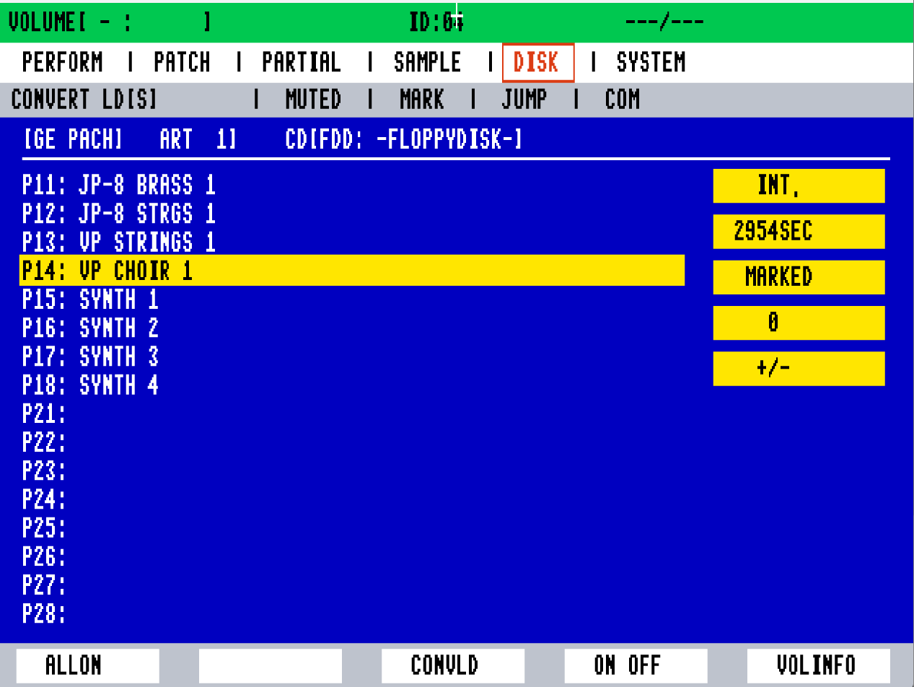

# Roland S-760 Digital Sampler — MAME Emulator Driver

[](https://www.mamedev.org/)
[](LICENSE)
[](tests/)
[](#hardware-architecture)


[-red.svg)](#hardware-architecture)

An open-source hardware emulation driver for the legendary **Roland S-760 16-Bit Digital Sampler** (1993) under the **MAME** emulation framework. This project accurately reproduces the S-760's internal architecture, full dual-display subsystem (Color CRT & Front LCD), memory-mapped gate array registers, mouse navigation, and multi-mode sampling interface.

---

## Screenshot



*Roland S-760 running in MAME with the OP-760 video expansion output (640x240 RGB color palette, Royal Blue `#0000C8` workspace, top Green status banner `#00C850`, yellow parameter highlights, and interactive mouse crosshair).*

---

## Key Hardware Pillars Emulated

| Pillar | Subsystem | Description & Emulated Specifications |
| :--- | :--- | :--- |
| **Pillar 1** | **OP-760 Video Board** | Emulates the RFSC16A VDP, 128KB TC511664 VRAM, VDP registers (`0xD000-0xD0FF`), and 10-pen RGB DAC palette rendering at 60Hz. |
| **Pillar 2** | **Front Panel LCD** | Emulates the built-in 160×64 monochrome LCD display (Epson SED1335 controller) with page and status views. |
| **Pillar 3** | **MCS-96 CPU & MMIO** | Intel 80C196 / MCS-96 microcontroller core, gate array MMIO decoding, interrupt logic, and 32MB sample SIMM addressing. |
| **Pillar 4** | **Mouse & Controllers** | Roland MU-1 mouse and RC-100 remote controller emulation with delta tracking and active-low keyboard navigation. |
| **Audio** | **DSP & Output DACs** | Stereo audio output routing (`lspeaker`, `rspeaker`) with clean startup. |

---

## Modes & Pages Implemented

The driver includes accurate layout rendering and interactive switching for all primary Roland S-760 operating modes:

1. **`PERFORM` (Performance Play)**: Multi-part performance matrix with MIDI channels, patch assignments, output bus routing (1-2 / 3-4), and volume/pan sliders.
2. **`PATCH` (Patch Edit)**: Patch assignment matrix, key split ranges, tuning offsets, and velocity curves.
3. **`PARTIAL` (Partial Edit)**: Time-Variant Filter (TVF cutoff & resonance), Time-Variant Amplifier (TVA), and envelope generators.
4. **`SAMPLE` (Sample & Waveform Edit)**: Real-time waveform display, loop points (Start/Loop/End), loop modes, and fine tune.
5. **`DISK` (Disk & Volume Management)**: Floppy disk volume loader (`[GE Pach] Art 1 CD[FDD: -FloppyDisk-]`), sound library catalog, and convert tools.
6. **`SYSTEM` (System Setup)**: SCSI host ID (`ID: 7`), Boot drive selection, Controller selection, Master tune (`440.0 Hz`), Output levels (`+4 dBu Balanced`), and 32MB Wave memory diagnostic.

---

## Important Notice: System Disk / ROMs Not Included

> [!IMPORTANT]
> **This repository contains strictly open-source driver source code.**
> It **DOES NOT** distribute any proprietary Roland operating system disks (`S760224.IMG`), copyrighted firmware ROMs, or factory sample sound libraries.

Users must provide their own legally acquired system disk:
1. Create a `roms/` directory in the project root.
2. Place your system disk image at `roms/s760.rom` (or inside `roms/s760.zip`).

---

## Building from Source

### Prerequisites
- **Compiler**: Visual Studio 2022 (MSVC v143+ with C++ Desktop tools) or Clang/GCC on Windows/Linux.
- **Python**: Python 3.10+ (used by MAME build scripts and the automated test harness).
- **Dependencies**: `pip install pytest Pillow` (for running the automated test suite).

### Compiling on Windows (Visual Studio 2022 / MSBuild)
```powershell
# Build driver library
& "C:\Program Files\Microsoft Visual Studio\2022\Community\MSBuild\Current\Bin\MSBuild.exe" `
  "mame-source\build\projects\windows\mames760\vs2022\mame_s760.vcxproj" /p:Configuration=Release /p:Platform=x64 /m

# Build standalone MAME executable
& "C:\Program Files\Microsoft Visual Studio\2022\Community\MSBuild\Current\Bin\MSBuild.exe" `
  "mame-source\build\projects\windows\mames760\vs2022\mames760.vcxproj" /p:Configuration=Release /p:Platform=x64 /m
```

---

## Running the Emulator

Launch the interactive emulator using the provided batch script:
```powershell
.\run_s760_mame.bat
```

Or run directly via command line:
```powershell
.\mame-source\mames760.exe s760 -rompath roms -window -nomaximize -resolution 1280x480
```

### Controls & Navigation

- **Mouse Movement**: Moves the on-screen crosshair cursor.
- **Mouse Left Click / Button 1**: Select active mode tab or toggle parameter.
- **Keyboard Arrow Keys (`Up` / `Down` / `Left` / `Right`)**: Direct precision cursor stepping (5px per step).
- **Enter / Spacebar**: Confirm selection / trigger action.

---

## Automated Test Harness

The project includes an automated test harness (`tests/mame_harness.py`) that drives MAME headlessly using frame-accurate Lua autoboot hooks (`emu.register_frame_done`), injecting inputs and verifying invariant properties, memory bounds, and pixel colors from runtime screenshots.

### Running Tests
```powershell
pytest tests -v
```

### Test Suite Summary (18 / 18 Passing)
- `tests/test_image_invariants.py`: Verifies Roland OS palette bounds, resolution constraints, and text layout invariants.
- `tests/test_interactive_ui.py`: Automates the complete Roland Owner's Manual multi-mode workflow (`DISK` → `PERFORM` → `SAMPLE` → `SYSTEM`), asserting active tab boxes and parameter highlights.
- `tests/test_mame_invariants.py`: Verifies C++ driver registration, device maps, and compilation consistency.

---

## Repository Structure

```
d:/S-760/
├── Main.png                                # Main UI reference screenshot
├── README.md                               # Project documentation & guide
├── .gitignore                              # Git exclusion rules (ROMs, binaries, snaps)
├── run_s760_mame.bat                       # Interactive launch script
├── mame-source/                            # MAME source tree
│   ├── src/mame/roland/s760.cpp            # S-760 MAME driver implementation
│   ├── scripts/target/mame/s760.lua        # Target driver build configuration
│   └── snap/s760/                          # Emulator screenshot output
├── docs/                                   # Hardware architecture & technical specifications
│   ├── images/Main.png                     # Documentation image assets
│   ├── mame/src/mame/roland/s760.cpp       # Synchronized reference source
│   └── reference/                          # S-760 service manual & schematic notes
└── tests/                                  # Automated Python & Lua test suite
    ├── mame_harness.py                     # Headless MAME runner & screenshot analyzer
    ├── test_interactive_ui.py              # Interactive UI & manual workflow tests
    ├── test_image_invariants.py            # Color palette & layout invariant tests
    └── test_mame_invariants.py             # MAME driver registration tests
```

---

## Trademark & Non-Affiliation Disclaimer

*Roland*, *S-760*, *OP-760*, and *RC-100* are registered trademarks of **Roland Corporation**.

This project is an independent, non-commercial open-source hardware emulation and research endeavor. It is **not** affiliated with, endorsed by, sponsored by, or associated with Roland Corporation.

---

## License

This project is distributed under the **BSD 3-Clause License** in compliance with MAME driver standards. See individual source files for copyright notices.
