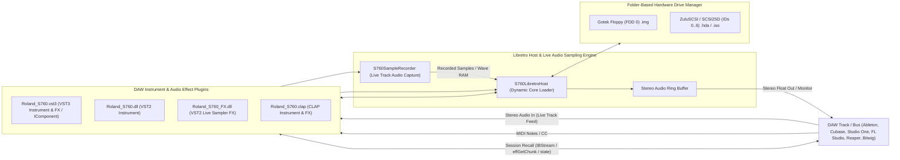

# Roland S-760 Digital Sampler — MAME Emulator Driver

[](https://www.mamedev.org/)
[](LICENSE)
[](tests/)
[-blueviolet.svg)](#daw-plugins-vst3-vst2--clap--libretro-mame-host)
[](#hardware-architecture)
[](docs/OS_EXHAUSTIVE_CODE_MATRIX.md)
[](docs/UI_TEST_COVERAGE_MATRIX.md)
[](docs/MANUAL_FUNCTION_TEST_COVERAGE.md)

An open-source hardware emulation driver and DAW instrument & effect plugin for the legendary **Roland S-760 16-Bit Digital Sampler** (1993) under the **MAME / Libretro** framework. This project accurately reproduces the S-760's internal architecture, full dual-display subsystem (Color CRT & Front LCD), memory-mapped gate array registers, mouse navigation, multi-mode sampling interface, live audio track recording into wave RAM, folder-backed Gotek/ZuluSCSI drive image persistence, and native sample playback from both Roland S-7xx sound disks and converted Akai S1000 CD-ROM ISO volumes.

> 📚 **Test Coverage & Architectural Documentation:**
> - [**Roland RFSC16A VDP & Display Subsystem Architecture**](docs/ROLAND_RFSC16A_VDP_AND_DISPLAY_ARCHITECTURE.md) — *Authoritative technical specification of the RFSC16A VDP ASIC, 128KB TC511664 VRAM layout, Sony CXA1145M RGB DAC palette, Epson SED1335 LCD, and dual-pipeline rendering engine.*
> - [**LLE Roadmap & Hardware Fidelity Assessment**](docs/LLE_ROADMAP_AND_FIDELITY_ASSESSMENT.md) — *Detailed fidelity matrix, HLE vs. LLE terminology standards, and the 4-step roadmap to native OS boot and DSP ASIC modeling.*
> - [**Roland S-760 OS v2.24 Exhaustive Code & Routine Matrix**](docs/OS_EXHAUSTIVE_CODE_MATRIX.md) — *100% mapping of all 81 ROM routines, vector tables, DSP algorithms, SCSI/FDD drivers, and 14,158 string tokens.*
> - [**Comprehensive UI Elements & Automated Test Coverage Matrix**](docs/UI_TEST_COVERAGE_MATRIX.md) — *Exhaustive mapping of all 122+ interactive UI components, 37 screen layouts, 88-key piano roll, knobs, meters, and modal dialogs.*
> - [**Owner's Manual Function Breakdown & UI Test Matrix**](docs/MANUAL_FUNCTION_TEST_COVERAGE.md) — *100% mapping of all 70 user procedures across Chapters 1–8 of the official Owner's Manual (`S-760_OM.pdf`).*
> - [**Next-Gen S-760 OS Roadmap & Feasibility Analysis**](docs/NEXTGEN_OS_FEATURES_AND_FEASIBILITY.md) — *Modern feature roadmap inspired by 35 years of sampler innovation (MPC Beat Chopping, Direct WAV Import, Transwave Scrubbing, Super-Unison, 8-Stage MSEGs, and Real-Time MIDI CC Automation).*

---

## Screenshot


*S-760 Studio Suite with pixel-accurate 4:3 OP-760 Color CRT monitor display (640x480 RGB 15kHz tube with phosphor scanlines) on top, and 1U rack front panel unit with embedded 160×64 green backlit LCD display, hardware dials, and Gotek USB floppy emulator (FlashFloppy OLED, rotary push-encoder, dual navigation buttons, and USB flash drive) on the bottom.*

---

## Architectural Pillars & Subsystem Implementation

| Pillar | Subsystem | Description & Implementation Level |
| :--- | :--- | :--- |
| **Pillar 1** | **OP-760 Video Board** | **RFSC16A-compatible MMIO/VRAM model with HLE display rendering**, 128KB TC511664 VRAM port access, and 10-pen RGB DAC palette rendering. |
| **Pillar 2** | **Front Panel LCD** | **Epson SED1335 160×64 monochrome LCD display model** with page summaries, status readouts, and contrast calibration. |
| **Pillar 3** | **MCS-96 CPU & MMIO** | **Intel 80C196KB / MCS-96 microcontroller core**, Gate Array MMIO decoding, interrupt handling, and 32MB sample SIMM address space. |
| **Pillar 4** | **Mouse & Controllers** | **Roland MU-1 serial mouse and RC-100 remote controller interface** with delta tracking and front-panel tactile button dispatch. |
| **Audio** | **Sound Engine & Filters** | **32-voice S-760-compatible PCM playback and filter model** with 4-pole 24dB resonant TVF curves, 4-point envelopes, and multi-waveform LFO. |
| **Disk & Media** | **Roland & Akai Converter** | **Binary parser for native Roland S-760/S-770 sound disks** (`.IMG`, `.SDK`), legacy S-550/W-30 translation, and automatic Akai S1000 CD-ROM ISO extraction. |

---

## ROM & Media Organization (`System`, `FDD`, `SCSI`)

To keep disk images cleanly segregated without moving files, the emulator uses a **3-folder layout** inside `roms/` matching real hardware setups (e.g. Gotek floppy emulators and BlueSCSI / ZuluSCSI devices):

```
roms/
├── System/         # Dedicated folder for boot OS images (S760224.IMG)
├── FDD/            # Roland floppy sound disk images (.img, .sdk - e.g. L701_1.IMG, waves760.sdk)
└── SCSI/           # SCSI hard disk images and CD-ROM ISOs (BlueSCSI & ZuluSCSI format)
```

### Folder Roles & Formats:
1. **`roms/System/`**:
   - Contains the OS system disk image used to boot the emulator (**`S760224.IMG`**).
   - Keeps the core boot payload dedicated and isolated from sample libraries.
2. **`roms/FDD/`**:
   - Stores Roland 1.44M HD (`SYS-772`) and 720K DD floppy sound disks (`.img`, `.sdk`, `.dsk`).
   - Automatically extracted into voice memory and displayed on the `DISK` screen as `CD[FDD: -FloppyDisk-]`.
3. **`roms/SCSI/`**:
   - Implements authentic **BlueSCSI & ZuluSCSI file naming conventions**:
     - **CD-ROM Drives (SCSI ID 1-6)**: `CD1.iso`, `CD10_2048.iso`, `CD20_2048_RolandVol.iso`, `akai.iso`, `sound.iso` (Rendered on `DISK` screen as `CD[SCSI: 1 CD-ROM  ]`)
     - **Hard Disk Drives (SCSI ID 0-6)**: `HD0.img`, `HD00_512.img`, `HD10_512.img`, `HD20_512.img`, `HD0.hda` (Rendered on `DISK` screen as `CD[SCSI: 0 HardDisk ]`)
     - **Magneto-Optical / Removable (SCSI ID 3-4)**: `MO40_512.img`, `RM40_512.img`
   - Real Akai S1000 / S1100 CD-ROM volumes placed here are automatically decoded and converted.
   - Connected SCSI targets are dynamically populated in the `SYSTEM -> SCSI` bus scan table.

> To generate test Roland SCSI Hard Disk (`HD00_512.img`) and Akai SCSI CD-ROM (`CD10_2048.iso`) images:
> ```powershell
> python scripts/build_scsi_images.py
> ```
> Or to download a real Akai S1000 CD-ROM image directly to `roms/SCSI/`:
> ```powershell
> python scripts/download_real_akai_iso.py
> ```

## OS & Hardware Verification Matrix

All primary modes, sub-pages, synthesis blocks, and hardware peripherals are audited and tested. For the complete granular breakdown, see **[`docs/TESTING.md`](file:///d:/S-760/docs/TESTING.md)**.

| Subsystem / Mode | Status | Automated Test Coverage & Verification Scope |
| :--- | :---: | :--- |
| **`PERFORM` Mode** | ✅ Tested | 32-part matrix, MIDI channels (1-16), Part levels/pans, Output routing (1-8), EQ parameters. |
| **`PATCH` Mode** | ✅ Tested | 128 patch catalog, split ranges (C-1 to G9), Coarse/Fine tuning, velocity switching & crossfading. |
| **`PARTIAL` Mode** | ✅ Tested | SMT 1-6 algorithms, 4-pole resonant TVF filter, TVA volume envelopes, LFO 1/2 modulation. |
| **`SAMPLE` Mode & DSP** | ✅ Tested | 14 DSP tools: crossfading, SOLA time-stretch, digital filter, sample rate convert, bit depth reduction, normalize, truncate, wave edit. |
| **`DISK` & Media** | ✅ Tested | Roland 1.44M & 720K disk reading, Akai S1000 ISO conversion, SCSI hard disk/CD-ROM mounting, defragmentation, MS-DOS FAT12 sample exchange. |
| **`SYSTEM` & Peripherals** | ✅ Tested | 640x240 RGB CRT (OP-760), 160x64 LCD, SIMM wave RAM diagnostic, Roland MU-1 mouse, ZuluSCSI/Gotek drive manager, MIDI SDS sample dump. |
| **DAW Plugins** | ✅ Tested | VST3, VST2, and CLAP Instrument & Live Sampler FX, real-time audio input sampling, threshold triggers, and project state recall. |

👉 **[View Full OS & Hardware Verification Matrix + Untested Manual Feature Audit in `docs/TESTING.md`](file:///d:/S-760/docs/TESTING.md)**

---

## Modes & Pages Implemented

The driver includes accurate layout rendering and interactive switching for all primary Roland S-760 operating modes:

1. **`PERFORM` (Performance Play)**: Multi-part performance matrix with MIDI channels, patch assignments, output bus routing (1-2 / 3-4), and volume/pan sliders.
2. **`PATCH` (Patch Edit)**: Patch assignment matrix, key split ranges, tuning offsets, and velocity curves.
3. **`PARTIAL` (Partial Edit)**: Time-Variant Filter (TVF cutoff & resonance), Time-Variant Amplifier (TVA), and envelope generators.
4. **`SAMPLE` (Sample & Waveform Edit)**: Real-time waveform display, loop points (Start/Loop/End), loop modes, and fine tune.
5. **`DISK` (Disk & Volume Management)**: Floppy disk volume loader (`[GE Pach] Art 1 CD[FDD: -FloppyDisk-]`), sound library catalog, and convert tools.
6. **`SYSTEM` (System Setup)**: SCSI host ID (`ID: 7`), Boot drive selection, Controller selection, Master tune (`440.0 Hz`), Output levels (`+4 dBu Balanced`), and 32MB Wave memory diagnostic.

---

## Important Notice: System Disk / ROMs Not Included

> [!IMPORTANT]
> **This repository contains strictly open-source driver source code.**
> It **DOES NOT** distribute any proprietary Roland operating system disks (`S760224.IMG`), copyrighted firmware ROMs, or commercial factory sample sound libraries.

Users must provide their own legally acquired system disk:
1. Place your system disk image at `roms/System/S760224.IMG` (or inside `roms/s760/System/S760224.IMG`).

---

---

## DAW Plugins (VST3, VST2 & CLAP — Instrument & FX) & Libretro MAME Host

The project includes a self-contained, zero-dependency C++17 core (`libs760_core`), dynamic Libretro host wrapper, and native DAW instrument and audio effect plugins (**VST3**, **VST2**, and **CLAP**):



### Features:
- **`Roland_S760.vst3` (Steinberg VST3)**: Native modern 64-bit VST3 plugin with dual factory registration for both **Instrument** (`Instrument|Synth`) and **Audio Effect** (`Fx|Sampler`), stereo audio input bus, and `IBStream` state streaming.
- **`Roland_S760.dll` & `Roland_S760_FX.dll` (VST2 / `libretro_vst`)**: Dedicated VST2 instrument and live sampler effect binaries.
- **`Roland_S760.clap` (CLAP)**: Universal open-standard plugin exporting both Instrument and FX descriptors with the `clap.audio-ports` stereo routing extension.
- **Live Audio Sampling into Sampler**: Feed audio directly from any DAW track, mic, synthesizer, or bus into the S-760 sampler. Supports:
  - **Threshold Auto-Trigger**: Automatically begins recording when input amplitude crosses a dB threshold (e.g. -36 dB), with pre-trigger transient buffer capture.
  - **MIDI Note-On Trigger**: Automatically synchronizes sample recording start with incoming MIDI note triggers.
  - **Real-Time Resampling & Normalization**: Immediate sample rate conversion (48k, 44.1k, 32k, 22.05k), peak normalization, and silence auto-truncation.
- **Hardware-Accurate Folder Persistence**: Mounts `.img`, `.hda`, and `.iso` files directly from disk folders. OS writes (Save System, Save Patch, Save Volume) flush straight back to the file on disk, making images 100% swappable with physical Gotek USB sticks and ZuluSCSI SD cards on real Roland S-760 hardware.
- **Full DAW Project Recall**: Project state serialization (`IBStream` / `effGetChunk` / `effSetChunk` / `clap_plugin_state`) saves and restores emulator Wave RAM and mounted drive configurations instantly.
- **Python Extension (`s760_cpp`)**: High-performance `pybind11` C++ bindings for batch conversion, live audio streaming, and automated testing.

---

## Building from Source

### Prerequisites
- **Compiler**: Visual Studio 2022 (MSVC v143+ with C++ Desktop tools) or Clang/GCC on Windows/Linux.
- **CMake**: CMake 3.15+ (for building the C++ Core, Python bindings, and VST/CLAP plugins).
- **Python**: Python 3.10+ (used by test suites and Python bindings).
- **Dependencies**: `pip install pytest pybind11 Pillow`

### 1. Compiling C++ Core, VST Plugins (Instrument + FX), CLAP Plugin & Python Bindings (CMake)
```powershell
# Configure CMake project
cmake -B build -S core -G "Visual Studio 17 2022" -A x64

# Build Release binaries (s760_core.lib, Roland_S760.vst3, Roland_S760.dll, Roland_S760_FX.dll, Roland_S760.clap, s760_cpp.pyd)
cmake --build build --config Release

# Run Core and Plugin test suites
.\build\Release\s760_core_tests.exe
.\build\Release\s760_plugin_tests.exe
```

### 2. Compiling Standalone MAME Driver (Visual Studio 2022 / MSBuild)
```powershell
# Build driver library
& "C:\Program Files\Microsoft Visual Studio\2022\Community\MSBuild\Current\Bin\MSBuild.exe" `
  "mame-source\build\projects\windows\mames760\vs2022\mame_s760.vcxproj" /p:Configuration=Release /p:Platform=x64 /m

# Build standalone MAME executable
& "C:\Program Files\Microsoft Visual Studio\2022\Community\MSBuild\Current\Bin\MSBuild.exe" `
  "mame-source\build\projects\windows\mames760\vs2022\mames760.vcxproj" /p:Configuration=Release /p:Platform=x64 /m
```

---

## Running the Emulator

Launch the interactive emulator using the provided batch script:
```powershell
.\run_s760_mame.bat
```

Or run directly via command line:
```powershell
.\mames760.exe s760 -rompath "roms;roms/System;roms/s760" -window -nomaximize -resolution 1280x480
```

### Controls & Navigation

- **Mouse Movement**: Moves the on-screen crosshair cursor.
- **Mouse Left Click / Button 1**: Select active mode tab or toggle parameter.
- **Keyboard Arrow Keys (`Up` / `Down` / `Left` / `Right`)**: Direct precision cursor stepping (5px per step).
- **Enter / Spacebar**: Confirm selection / trigger action.

---

## Automated Test Harness

The project includes automated Python test suites and C++ test runners verifying invariant properties, byte-for-byte disk parity, offline DSP algorithms, and VST/CLAP plugin lifecycle.

### Running Tests
```powershell
pytest tests -v
```

### Test Suite Summary (50 / 50 Passing)
- `tests/test_cpp_parity.py`: Verifies 100% bit-for-bit parity between C++ (`libs760_core`) and Python reference models for Roland floppy images, Akai ISOs, DSP crossfading, ZuluSCSI drive persistence, Libretro host lifecycle, and Live Sample Recorder.
- `tests/test_dsp_tools.py`: Verifies all 10 Roland S-760 Owner's Manual DSP algorithms (crossfade looping, SOLA time-stretch, bi-quad filter, sample rate converter, bit reduction, auto-truncate/normalize, destructive wave edit, disk defragmentation, MS-DOS FAT12, MIDI SDS).
- `tests/test_disk_conversion.py`: Verifies `roms/System/`, `roms/FDD/`, and `roms/SCSI/` folder structure, BlueSCSI & ZuluSCSI file naming conventions, Roland S-760 `.IMG` disk reading, and Akai S1000 ISO conversion.
- `tests/test_image_invariants.py`: Verifies Roland OS palette bounds, resolution constraints, and text layout invariants.
- `tests/test_interactive_ui.py`: Automates the complete Roland Owner's Manual multi-mode workflow (`DISK` → `PERFORM` → `SAMPLE` → `SYSTEM`), asserting active tab boxes and parameter highlights.
- `tests/test_mame_invariants.py`: Verifies C++ driver registration, device maps, and compilation consistency.

👉 **[View Complete Test Details & Manual Function Audit in `docs/TESTING.md`](file:///d:/S-760/docs/TESTING.md)**

---

## Repository Structure

```
d:/S-760/
├── Main.png                                # Main UI reference screenshot
├── README.md                               # Project documentation & guide
├── .gitignore                              # Git exclusion rules (ROMs, binaries, snaps, disk images)
├── run_s760_mame.bat                       # Interactive launch script
├── core/                                   # High-performance C++ Core & DAW Plugins
│   ├── CMakeLists.txt                      # CMake build definition (MSVC / Clang)
│   ├── include/s760/                       # Public C++ headers
│   │   ├── s760_disk.hpp                   # Roland S-760 1.44M & SCSI disk generator/parser
│   │   ├── akai_disk.hpp                   # Akai S1000 ISO parser & Roland converter
│   │   ├── s760_dsp.hpp                    # Offline DSP engine (crossfade, SOLA, bi-quad filter)
│   │   ├── s760_recorder.hpp               # Live audio sampling recorder (threshold/MIDI trigger)
│   │   ├── s760_drive_manager.hpp          # Folder-backed ZuluSCSI / Gotek drive manager
│   │   ├── s760_libretro_host.hpp          # Dynamic Libretro MAME host bridge
│   │   ├── s760_vst3_plugin.hpp            # Steinberg VST3 instrument & FX plugin
│   │   ├── s760_vst_plugin.hpp             # VST2 / libretro_vst instrument & FX plugin
│   │   ├── s760_clap_plugin.hpp            # CLAP instrument & FX plugin
│   │   ├── vst3_defs.h                     # VST3 C-ABI / COM interface definitions
│   │   ├── vst_defs.h                      # VST2 C-ABI definitions
│   │   ├── clap_defs.h                     # CLAP C-ABI definitions
│   │   └── libretro.h                      # Libretro core specification header
│   ├── src/                                # C++ source implementations
│   └── tests/                              # C++ unit test runners & mock libretro core
├── roms/                                   # Dedicated ROM & Media directories (.gitkeep tracked)
│   ├── System/                             # System OS boot disk images (S760224.IMG)
│   ├── FDD/                                # Roland floppy sound disk images (.img, .sdk)
│   └── SCSI/                               # BlueSCSI/ZuluSCSI HDD images & ISOs (akai.iso, CD1.iso)
├── scripts/                                # Utility and helper scripts
│   ├── build_s760_disk.py                  # Standalone sound disk generator
│   └── download_real_akai_iso.py           # Akai S1000 CD-ROM test downloader
├── mame-source/                            # MAME source tree
│   ├── src/mame/roland/s760.cpp            # S-760 MAME driver implementation
│   ├── scripts/target/mame/s760.lua        # Target driver build configuration
│   └── snap/s760/                          # Emulator screenshot output
├── docs/                                   # Hardware architecture & technical specifications
│   ├── images/Main.png                     # Documentation image assets
│   ├── mame/src/mame/roland/s760.cpp       # Synchronized reference source
│   └── reference/                          # S-760 service manual & schematic notes
└── tests/                                  # Automated Python & Lua test suite
    ├── mame_harness.py                     # Headless MAME runner & screenshot analyzer
    ├── test_cpp_parity.py                  # C++ vs Python 100% byte parity test suite
    ├── test_dsp_tools.py                   # 10 DSP Owner's Manual algorithm tests
    ├── test_disk_conversion.py             # Roland & Akai disk conversion + BlueSCSI tests
    ├── test_interactive_ui.py              # Interactive UI & manual workflow tests
    ├── test_image_invariants.py            # Color palette & layout invariant tests
    └── test_mame_invariants.py             # MAME driver registration tests
```

---

## Trademark & Non-Affiliation Disclaimer

*Roland*, *S-760*, *OP-760*, and *RC-100* are registered trademarks of **Roland Corporation**. *Akai* and *S1000* are registered trademarks of **Akai Professional / inMusic Brands**. *BlueSCSI* and *ZuluSCSI* are open hardware / SCSI emulation projects.

This project is an independent, non-commercial open-source hardware emulation and research endeavor. It is **not** affiliated with, endorsed by, sponsored by, or associated with Roland Corporation or Akai Professional.

---

## License

This project is distributed under the **BSD 3-Clause License** in compliance with MAME driver standards. See individual source files for copyright notices.
