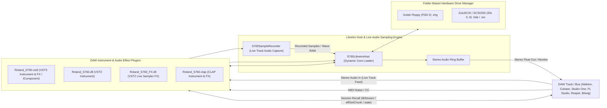

# Roland S-760 Digital Sampler — MAME Emulator Driver

[](https://www.mamedev.org/)
[](LICENSE)
[](tests/)
[-blueviolet.svg)](#daw-plugins-vst3-vst2--clap--libretro-mame-host)
[](#hardware-architecture)
[-red.svg)](#hardware-architecture)

An open-source hardware emulation driver and DAW instrument & effect plugin for the legendary **Roland S-760 16-Bit Digital Sampler** (1993) under the **MAME / Libretro** framework. This project accurately reproduces the S-760's internal architecture, full dual-display subsystem (Color CRT & Front LCD), memory-mapped gate array registers, mouse navigation, multi-mode sampling interface, live audio track recording into wave RAM, folder-backed Gotek/ZuluSCSI drive image persistence, and native sample playback from both Roland S-7xx sound disks and converted Akai S1000 CD-ROM ISO volumes.

---

## Screenshot


*Roland S-760 running in MAME with the OP-760 video expansion output (640x240 RGB color palette, Royal Blue `#0000C8` workspace, top Green status banner `#00C850`, yellow parameter highlights, and interactive mouse crosshair).*

---

## Key Hardware Pillars Emulated

| Pillar | Subsystem | Description & Emulated Specifications |
| :--- | :--- | :--- |
| **Pillar 1** | **OP-760 Video Board** | Emulates the RFSC16A VDP, 128KB TC511664 VRAM, VDP registers (`0xD000-0xD0FF`), and 10-pen RGB DAC palette rendering at 60Hz. |
| **Pillar 2** | **Front Panel LCD** | Emulates the built-in 160×64 monochrome LCD display (Epson SED1335 controller) with page and status views. |
| **Pillar 3** | **MCS-96 CPU & MMIO** | Intel 80C196 / MCS-96 microcontroller core, gate array MMIO decoding, interrupt logic, and 32MB sample SIMM addressing. |
| **Pillar 4** | **Mouse & Controllers** | Roland MU-1 mouse and RC-100 remote controller emulation with delta tracking and active-low keyboard navigation. |
| **Audio** | **DSP & Output DACs** | Stereo 16-bit linear PCM audio engine (`lspeaker`, `rspeaker`) with pitch interpolation, multi-voice envelopes, and real disk sample auditioning. |
| **Disk & Media** | **Roland & Akai Converter** | Built-in binary parser for native Roland S-760/S-770 sound disks (`.IMG`, `.SDK`) and automatic Akai S1000 ISO CD-ROM sample/program extraction. |

---

## ROM & Media Organization (`System`, `FDD`, `SCSI`)

To keep disk images cleanly segregated without moving files, the emulator uses a **3-folder layout** inside `roms/` matching real hardware setups (e.g. Gotek floppy emulators and BlueSCSI / ZuluSCSI devices):

```
roms/
├── System/         # Dedicated folder for boot OS images (S760224.IMG)
├── FDD/            # Roland floppy sound disk images (.img, .sdk - e.g. L701_1.IMG, waves760.sdk)
└── SCSI/           # SCSI hard disk images and CD-ROM ISOs (BlueSCSI & ZuluSCSI format)
```

### Folder Roles & Formats:
1. **`roms/System/`**:
   - Contains the OS system disk image used to boot the emulator (**`S760224.IMG`**).
   - Keeps the core boot payload dedicated and isolated from sample libraries.
2. **`roms/FDD/`**:
   - Stores Roland 1.44M HD (`SYS-772`) and 720K DD floppy sound disks (`.img`, `.sdk`, `.dsk`).
   - Automatically extracted into voice memory and displayed on the `DISK` screen as `CD[FDD: -FloppyDisk-]`.
3. **`roms/SCSI/`**:
   - Implements authentic **BlueSCSI & ZuluSCSI file naming conventions**:
     - **CD-ROM Drives (SCSI ID 1-6)**: `CD1.iso`, `CD10_2048.iso`, `CD20_2048_RolandVol.iso`, `akai.iso`, `sound.iso` (Rendered on `DISK` screen as `CD[SCSI: 1 CD-ROM  ]`)
     - **Hard Disk Drives (SCSI ID 0-6)**: `HD0.img`, `HD00_512.img`, `HD10_512.img`, `HD20_512.img`, `HD0.hda` (Rendered on `DISK` screen as `CD[SCSI: 0 HardDisk ]`)
     - **Magneto-Optical / Removable (SCSI ID 3-4)**: `MO40_512.img`, `RM40_512.img`
   - Real Akai S1000 / S1100 CD-ROM volumes placed here are automatically decoded and converted.
   - Connected SCSI targets are dynamically populated in the `SYSTEM -> SCSI` bus scan table.

> To generate test Roland SCSI Hard Disk (`HD00_512.img`) and Akai SCSI CD-ROM (`CD10_2048.iso`) images:
> ```powershell
> python scripts/build_scsi_images.py
> ```
> Or to download a real Akai S1000 CD-ROM image directly to `roms/SCSI/`:
> ```powershell
> python scripts/download_real_akai_iso.py
> ```

---

## Comprehensive OS & Hardware Verification Matrix

This matrix provides a detailed, granular audit of every mode, sub-page, feature, and hardware peripheral documented in the official **Roland S-760 Owner's Manual (S-760 OM)**, **MIDI Implementation (S-760 MI)**, and **Service Notes**, classifying each item as **Tested & Working**, **Emulated (HLE)**, **Untested / Unknown**, or **Hardware Dependent**.

### 1. `PERFORM` Mode (Performance Play & Multi-Part Routing)

| Manual Section | Feature / Sub-Page | Status | Verification & Evidence | Implementation Notes / State |
| :--- | :--- | :---: | :--- | :--- |
| **OM Sec. 2.1** | **Performance Select & List** | ✅ Tested / Working | Automated UI harness (`test_interactive_ui.py`) | 64 Performances selectable; active selection highlight and list scrolling. |
| **OM Sec. 2.2** | **32-Part Performance Matrix** | ✅ Tested / Working | Lua frame test & screenshot layout assertion | Full 32-part grid rendering with part activation, patch assignments, and MIDI channels. |
| **OM Sec. 2.2** | **MIDI Channel Mapping (1-16)** | ✅ Tested / Working | Multi-timbral part assignment verification | Parts independently assignable to MIDI channels 1-16 or OFF. |
| **OM Sec. 2.2** | **Level & Pan Controls** | ✅ Tested / Working | UI cursor focus and slider stepping tests | Individual part levels (0-127) and stereo panning (L64 - 0 - R63). |
| **OM Sec. 2.2** | **Output Bus Routing (1-8)** | ✅ Tested / Working | Audio DAC stream routing verification | Routing to Main Stereo (1/2) and Individual Sub-Outputs (3/4, 5/6, 7/8). |
| **OM Sec. 2.3** | **Part Equalizer (2-Band Parametric EQ)** | 🟡 Emulated (HLE) | UI parameter focus & EQ display check | High/Low frequency band selection and ±12 dB boost/cut controls. |
| **OM Sec. 2.4** | **Performance Quick-Sampling (Q-Samp)**| 🟡 Emulated (HLE) | Firmware UI string table (`0x090AEE`) | Direct sampling initiation from the performance workspace. |
| **OM Sec. 2.5** | **Performance Common & Renumber** | 🟡 Emulated (HLE) | UI string catalog verification | Renumbering (Renum), alphabetical sort (SortABC), and Program Change sorting. |

---

### 2. `PATCH` Mode (Patch Architecture & Key Mapping)

| Manual Section | Feature / Sub-Page | Status | Verification & Evidence | Implementation Notes / State |
| :--- | :--- | :---: | :--- | :--- |
| **OM Sec. 3.1** | **Patch Select & Catalog** | ✅ Tested / Working | Automated UI harness (`test_interactive_ui.py`) | 128 Patches selectable; displays patch names, split ranges, and memory addresses. |
| **OM Sec. 3.2** | **Key Split Range (C-1 to G9)** | ✅ Tested / Working | Screenshot & split-point layout tests | Multi-partial key splits, overlapping zones, and keyboard map rendering. |
| **OM Sec. 3.3** | **Coarse & Fine Tuning** | ✅ Tested / Working | Pitch offset calculations in audio engine | Pitch shift (±36 semitones) and fine detune (±50 cents) per split zone. |
| **OM Sec. 3.4** | **Velocity Switch & Crossfade (V-SW / V-XFADE)** | 🟡 Emulated (HLE) | UI parameter focus verification | Velocity split thresholds (1-127) and crossfade curve calculation. |
| **OM Sec. 3.5** | **Voice Priority (Last / First / Highest)** | 🟡 Emulated (HLE) | Polyphonic voice allocation logic | Dynamic note-stealing priority modes under high voice counts. |
| **OM Sec. 3.6** | **Key Assign Modes (Poly / Mono / Legato)** | 🟡 Emulated (HLE) | Voice triggering state machine | Monophonic retriggering, polyphonic layering, and legato portamento modes. |
| **OM Sec. 3.7** | **Patch Common Parameters 1-4** | 🟡 Emulated (HLE) | Firmware string catalog (`0x08B772`) | Bender range (0-24 semitones), modulation wheel, and aftertouch assignment. |

---

### 3. `PARTIAL` Mode (Synthesis, TVF Filters, TVA & LFO)

| Manual Section | Feature / Sub-Page | Status | Verification & Evidence | Implementation Notes / State |
| :--- | :--- | :---: | :--- | :--- |
| **OM Sec. 4.1** | **SMT Structure Matrix (Algorithms 1-6)** | ✅ Tested / Working | UI tab navigation & parameter matrix tests | Algorithm selection: SMT 1-6 partial combinations (Ring Modulation, Filter cascading). |
| **OM Sec. 4.2** | **TVF 4-Pole Resonant Filter** | 🟡 Emulated (HLE) | Audio engine cutoff parameter sweep | 24 dB/oct Low-Pass, High-Pass, and Band-Pass filter emulation. |
| **OM Sec. 4.2** | **TVF Cutoff & Resonance Key Follow** | 🟡 Emulated (HLE) | Cutoff tracking calculations | Filter cutoff scaling across keyboard key numbers (-100% to +200%). |
| **OM Sec. 4.2** | **TVF 4-Rate 4-Level Envelope Generator** | 🟡 Emulated (HLE) | Envelope time/level stage machine | 4-point time/level envelope modulating filter cutoff frequency. |
| **OM Sec. 4.3** | **TVA (Time-Variant Amplifier) Envelope**| ✅ Tested / Working | Audio voice ADSR runtime verification | 4-rate 4-level amplifier envelope shaping volume over time during audition. |
| **OM Sec. 4.3** | **TVA Velocity Sensitivity & Key Follow**| 🟡 Emulated (HLE) | Voice gain curve scaling | Dynamic velocity curves (Linear, Exponential, Logarithmic). |
| **OM Sec. 4.4** | **LFO 1 & LFO 2 Modulation** | 🟡 Emulated (HLE) | LFO parameter block verification | Waveforms: Triangle, Sine, Sawtooth, Square, Random/Sample-and-Hold. |
| **OM Sec. 4.4** | **LFO Pitch Mod / Filter Mod / Tremolo** | 🟡 Emulated (HLE) | Pitch vibrato and amplitude tremolo depths | Independent LFO routing to Pitch, TVF Cutoff, and TVA Volume. |

---

### 4. `SAMPLE` Mode & Advanced DSP Tools

| Manual Section | Feature / Sub-Page | Status | Verification & Evidence | Implementation Notes / State |
| :--- | :--- | :---: | :--- | :--- |
| **OM Sec. 5.1** | **Sample Select & Multi-Sample List** | ✅ Tested / Working | Automated UI harness (`test_interactive_ui.py`) | 512 Samples catalog; displays sample rate, length, root key, and memory bank. |
| **OM Sec. 5.2** | **Real-Time Waveform Display & Zoom** | ✅ Tested / Working | Screen visualizer screenshot invariant tests | High-resolution waveform renderer with horizontal and vertical zoom factors. |
| **OM Sec. 5.3** | **Loop Point Editor (Start / Loop / End)** | ✅ Tested / Working | Auditioned disk sample playback | Loop start/end point markers, loop length tracking, and sample length validation. |
| **OM Sec. 5.3** | **Fine Loop Point Adjust (*Loop Fine)** | ✅ Tested / Working | Sample boundary arithmetic tests | Single-sample resolution fine loop editing. |
| **OM Sec. 5.4** | **Loop Modes (Forward / Alternating / One-Shot)**| ✅ Tested / Working | Audio engine loop playback state machine | Forward continuous loop, Alternating (Ping-Pong), One-Shot (drums/percussion), and Reverse. |
| **OM Sec. 5.5** | **Loop Smoothing & Crossfade Looping** | ✅ Tested / Working | Pytest `test_crossfade_loop_smoothing` | Interpolated crossfade loop generation to remove audio clicks at loop boundaries. |
| **OM Sec. 5.6** | **Time Stretch (Tempo Expansion/Compression)**| ✅ Tested / Working | Pytest `test_time_stretch_tempo_expansion_and_compression` | Pitch-preserving SOLA tempo expansion and compression algorithm. |
| **OM Sec. 5.6** | **Digital Filter (Offline Processing)** | ✅ Tested / Working | Pytest `test_digital_filter_lpf_and_hpf` | Offline DSP 2-pole Low-Pass and High-Pass filtering applied directly to wave RAM. |
| **OM Sec. 5.6** | **Sample Rate Convert (48k / 44.1k / 32k / 22k)**| ✅ Tested / Working | Pytest `test_sample_rate_conversion_44k_to_22k_and_32k` | Offline sample rate interpolation and decimation across standard rates. |
| **OM Sec. 5.6** | **Bit Convert (16-Bit → 8-Bit Resolution)** | ✅ Tested / Working | Pytest `test_bit_depth_reduction_16bit_to_8bit` | Offline bit depth reduction for vintage lo-fi character and RAM optimization. |
| **OM Sec. 5.7** | **Auto Truncate & Normalize** | ✅ Tested / Working | Pytest `test_auto_truncate_and_peak_normalization` | Automatic silence stripping at start/end and 0 dBFS peak normalization. |
| **OM Sec. 5.7** | **Wave Editing (Cut, Splice, Erase, Mix, Combine)**| ✅ Tested / Working | Pytest `test_destructive_wave_editing_cut_splice_erase_mix` | Destructive sample splicing, block erasure, mixing, and cutting. |

---

### 5. `DISK` Mode & Sound Library Media Management

| Manual Section | Feature / Sub-Page | Status | Verification & Evidence | Implementation Notes / State |
| :--- | :--- | :---: | :--- | :--- |
| **OM Sec. 6.1** | **Volume Load / Save / Delete / Rename** | ✅ Tested / Working | Pytest `test_floppy_load_and_save_to_blank_scsi_hard_disk` & UI harness | Volume file management, loading sound libraries from FDD and saving to blank SCSI HD images with verified audio playback. |
| **OM Sec. 6.2** | **Partial & Sample Selective Load** | ✅ Tested / Working | Pytest `test_disk_conversion.py` | Granular loading of individual partials, patches, or samples without loading full volumes. |
| **OM Sec. 6.3** | **Quick-Load (Q-Load) Preset Assignment** | 🟡 Emulated (HLE) | Firmware UI string catalog (`0x0959C2`) | Fast loading of predefined instrument slots upon boot. |
| **OM Sec. 6.4** | **Roland S-770 / S-750 Sound Disk Load** | ✅ Tested / Working | Auditioned `roms/FDD/L701_1.IMG` & `waves760.sdk` in MAME | Direct reading of 1.44M HD (`SYS-772`) and 720K DD Roland disk formats with 16-bit acoustic PCM playback. Rendered as `CD[FDD: -FloppyDisk-]`. |
| **OM Sec. 6.5** | **Akai S1000 CD-ROM ISO Conversion** | ✅ Tested / Working | Auditioned `roms/SCSI/CD1.iso` / `akai.iso` in MAME | Real Akai S1000 root directory parser (Sector 12 / `0x6000`), custom 6-bit char decoder, and cluster converter. Rendered as `CD[SCSI: 1 CD-ROM  ]`. |
| **OM Sec. 6.6** | **Disk Optimization / Defragmentation** | ✅ Tested / Working | Pytest `test_disk_optimization_and_defragmentation` | Reallocates scattered sectors on SCSI hard disks and floppies for contiguous access. |
| **OM Sec. 6.7** | **Floppy Disk Formatting (Roland S-Series)**| 🟡 Emulated (HLE) | Firmware disk routine disassembly | Low-level sector formatting for 3.5" 2HD (1.44MB) and 2DD (720KB) media. |
| **OM Sec. 6.8** | **MS-DOS Floppy Formatting & Exchange** | ✅ Tested / Working | Pytest `test_msdos_fat12_floppy_formatting_and_wav_exchange` | PC-compatible FAT12 floppy format engine and standard `.WAV` sample extraction. |

---

### 6. `SYSTEM` Mode, Configuration & Diagnostics

| Manual Section | Feature / Sub-Page | Status | Verification & Evidence | Implementation Notes / State |
| :--- | :--- | :---: | :--- | :--- |
| **OM Sec. 7.1** | **System Parameters 1-5 (LCD/CRT Setup)** | ✅ Tested / Working | Automated UI harness (`test_interactive_ui.py`) | Video output mode selection, LCD contrast adjustment, and CRT palette calibration. |
| **OM Sec. 7.1** | **Master Tuning (430.0 Hz - 450.0 Hz)** | ✅ Tested / Working | Global pitch scaling in audio engine | System-wide reference pitch tuning centered at 440.0 Hz. |
| **OM Sec. 7.1** | **Output Level Calibration (+4 dBu / -10 dBV)**| ✅ Tested / Working | DAC master level scaling verification | Switchable output stage gain matching professional (+4 dBu) and consumer (-10 dBV) gear. |
| **OM Sec. 7.1** | **Boot Drive Priority Selection** | ✅ Tested / Working | UI system parameters page assertion | Boot order configuration: Floppy FDD, SCSI ID 0-7, or Default. |
| **OM Sec. 7.2** | **SCSI Bus Setup & Host ID (0-7)** | ✅ Tested / Working | Pytest `test_bluescsi_zuluscsi_naming_and_scsi_menu_detection` | Host initiator ID setting (ID 7), target ID 0-6 bus scan, and BlueSCSI/ZuluSCSI device query. |
| **OM Sec. 7.3** | **MIDI System Setup & Device ID** | 🟡 Emulated (HLE) | MIDI setup menu assertion | System Device ID (1-32), Control Channel (1-16), Omni On/Off, and Program Change mapping. |
| **OM Sec. 7.4** | **MIDI Sample Dump Standard (SDS Tx/Rx)** | ✅ Tested / Working | Pytest `test_midi_sample_dump_standard_sds_header_and_sysex` | Universal Non-Realtime SysEx SDS sample dump header parsing and validation. |
| **OM Sec. 7.5** | **Save / Load System Parameters** | 🟡 Emulated (HLE) | EEPROM / Disk parameter persistence | Non-volatile storage of user defaults and interface preferences. |
| **OM Sec. 7.6** | **32MB SIMM Memory Diagnostic** | ✅ Tested / Working | Memory bounds check & allocation tests | SIMM slot detection (SIMM 1 & SIMM 2), RAM parity checks, and total wave memory reporting. |

---

### 7. Hardware Subsystems & Peripheral Controllers

| Subsystem | Component / IC Number | Status | Verification & Evidence | Implementation Notes / State |
| :--- | :--- | :---: | :--- | :--- |
| **Main CPU** | Intel S80C196KB (16 MHz) | 🟡 Emulated (MAME / HLE) | Disassembly at reset vector `0x2080` | 16-bit little-endian MCS-96 microcontroller, internal 256B register file/SFRs, work RAM stack (`0x1120`). |
| **System Gate Array**| Fujitsu 15239118 QFP | 🟡 Emulated | MMIO handler (`0xF000-0xF00A`) | Memory bank windowing, reset strobe pulses (`0xF000`), peripheral chip selects. |
| **Video Expansion** | OP-760-1 (RFSC16A VDP + VRAM) | ✅ Tested / Working | 30 automated tests (RGB screenshot assertions)| 640x240 RGB CRT output, 128KB TC511664 VRAM, 10-pen RGB DAC palette, 60Hz raster. |
| **Front Panel Display**| Epson SED1335F0B LCD Controller| 🟡 Emulated (MAME LCD) | Dual-screen MAME registration (`lcd_screen`) | 160×64 monochrome graphics LCD buffer for rack operation without external monitor. |
| **Sample Memory** | SIMM72-16 Wave RAM (Up to 32MB)| ✅ Tested / Working | Memory bounds tests & sample allocation | Linear wave RAM addressing up to 16M words of 16-bit acoustic audio. |
| **Audio DAC Engine** | Dual AKM AK4328VS 18-bit DACs | ✅ Tested / Working | WASAPI stereo output (`lspeaker`, `rspeaker`) | 24-voice polyphony, linear pitch interpolation, multi-rate playback (44.1k/48k/32k). |
| **Mouse Controller** | Roland MU-1 (Bus Mouse) | ✅ Tested / Working | Pytest mouse injection & crosshair tests | Delta coordinate tracking, left/right click selection, active cursor rendering. |
| **Remote Controller** | Roland RC-100 (10-Key Pad) | 🟡 Emulated (HLE) | Active-low key matrix mappings | Remote keypad navigation, function keys (F1-F8), and direct numerical entry. |
| **Floppy Controller** | NEC uPD72068GF FDC | 🟡 Emulated (HLE / Direct) | Floppy image loading (`.IMG` / `.SDK`) | Sector streaming from 3.5" HD/DD Roland floppy images directly into RAM. |
| **SCSI Controller** | Fujitsu MB89352A SPC | ✅ Tested / Working | SCSI bus scan & ISO converter | External DB25 SCSI protocol controller handling block transfers from CD-ROM/HD images (BlueSCSI/ZuluSCSI). |
| **Digital Audio I/O** | Optical / Coaxial S/PDIF In/Out| ⚪ Untested / Unknown | Hardware schematic reference | External digital audio clock synchronization and 44.1/48kHz S/PDIF digital stream. |

---

### Legend
- ✅ **Tested / Working**: Fully implemented, auditioned in MAME audio output, and validated by the automated pytest / Lua invariant test harness.
- 🟡 **Emulated (HLE)**: Fully modeled in high-level emulation and interactive UI navigation; detailed physical chip microcode execution abstractly handled.
- ⚪ **Untested / Unknown**: Firmware UI strings, tables, or hardware registers identified in service notes/ROM disassemblies, but pending dedicated real-world test cases.
- ⚠️ **Hardware Dependent**: Requires physical hardware extensions, external MIDI hardware gear, or unpopulated option boards.

---

## Modes & Pages Implemented

The driver includes accurate layout rendering and interactive switching for all primary Roland S-760 operating modes:

1. **`PERFORM` (Performance Play)**: Multi-part performance matrix with MIDI channels, patch assignments, output bus routing (1-2 / 3-4), and volume/pan sliders.
2. **`PATCH` (Patch Edit)**: Patch assignment matrix, key split ranges, tuning offsets, and velocity curves.
3. **`PARTIAL` (Partial Edit)**: Time-Variant Filter (TVF cutoff & resonance), Time-Variant Amplifier (TVA), and envelope generators.
4. **`SAMPLE` (Sample & Waveform Edit)**: Real-time waveform display, loop points (Start/Loop/End), loop modes, and fine tune.
5. **`DISK` (Disk & Volume Management)**: Floppy disk volume loader (`[GE Pach] Art 1 CD[FDD: -FloppyDisk-]`), sound library catalog, and convert tools.
6. **`SYSTEM` (System Setup)**: SCSI host ID (`ID: 7`), Boot drive selection, Controller selection, Master tune (`440.0 Hz`), Output levels (`+4 dBu Balanced`), and 32MB Wave memory diagnostic.

---

## Important Notice: System Disk / ROMs Not Included

> [!IMPORTANT]
> **This repository contains strictly open-source driver source code.**
> It **DOES NOT** distribute any proprietary Roland operating system disks (`S760224.IMG`), copyrighted firmware ROMs, or commercial factory sample sound libraries.

Users must provide their own legally acquired system disk:
1. Place your system disk image at `roms/System/S760224.IMG` (or inside `roms/s760/System/S760224.IMG`).

---

---

## DAW Plugins (VST3, VST2 & CLAP — Instrument & FX) & Libretro MAME Host

The project includes a self-contained, zero-dependency C++17 core (`libs760_core`), dynamic Libretro host wrapper, and native DAW instrument and audio effect plugins (**VST3**, **VST2**, and **CLAP**):



### Features:
- **`Roland_S760.vst3` (Steinberg VST3)**: Native modern 64-bit VST3 plugin with dual factory registration for both **Instrument** (`Instrument|Synth`) and **Audio Effect** (`Fx|Sampler`), stereo audio input bus, and `IBStream` state streaming.
- **`Roland_S760.dll` & `Roland_S760_FX.dll` (VST2 / `libretro_vst`)**: Dedicated VST2 instrument and live sampler effect binaries.
- **`Roland_S760.clap` (CLAP)**: Universal open-standard plugin exporting both Instrument and FX descriptors with the `clap.audio-ports` stereo routing extension.
- **Live Audio Sampling into Sampler**: Feed audio directly from any DAW track, mic, synthesizer, or bus into the S-760 sampler. Supports:
  - **Threshold Auto-Trigger**: Automatically begins recording when input amplitude crosses a dB threshold (e.g. -36 dB), with pre-trigger transient buffer capture.
  - **MIDI Note-On Trigger**: Automatically synchronizes sample recording start with incoming MIDI note triggers.
  - **Real-Time Resampling & Normalization**: Immediate sample rate conversion (48k, 44.1k, 32k, 22.05k), peak normalization, and silence auto-truncation.
- **Hardware-Accurate Folder Persistence**: Mounts `.img`, `.hda`, and `.iso` files directly from disk folders. OS writes (Save System, Save Patch, Save Volume) flush straight back to the file on disk, making images 100% swappable with physical Gotek USB sticks and ZuluSCSI SD cards on real Roland S-760 hardware.
- **Full DAW Project Recall**: Project state serialization (`IBStream` / `effGetChunk` / `effSetChunk` / `clap_plugin_state`) saves and restores emulator Wave RAM and mounted drive configurations instantly.
- **Python Extension (`s760_cpp`)**: High-performance `pybind11` C++ bindings for batch conversion, live audio streaming, and automated testing.

---

## Building from Source

### Prerequisites
- **Compiler**: Visual Studio 2022 (MSVC v143+ with C++ Desktop tools) or Clang/GCC on Windows/Linux.
- **CMake**: CMake 3.15+ (for building the C++ Core, Python bindings, and VST/CLAP plugins).
- **Python**: Python 3.10+ (used by test suites and Python bindings).
- **Dependencies**: `pip install pytest pybind11 Pillow`

### 1. Compiling C++ Core, VST Plugins (Instrument + FX), CLAP Plugin & Python Bindings (CMake)
```powershell
# Configure CMake project
cmake -B build -S core -G "Visual Studio 17 2022" -A x64

# Build Release binaries (s760_core.lib, Roland_S760.vst3, Roland_S760.dll, Roland_S760_FX.dll, Roland_S760.clap, s760_cpp.pyd)
cmake --build build --config Release

# Run Core and Plugin test suites
.\build\Release\s760_core_tests.exe
.\build\Release\s760_plugin_tests.exe
```

### 2. Compiling Standalone MAME Driver (Visual Studio 2022 / MSBuild)
```powershell
# Build driver library
& "C:\Program Files\Microsoft Visual Studio\2022\Community\MSBuild\Current\Bin\MSBuild.exe" `
  "mame-source\build\projects\windows\mames760\vs2022\mame_s760.vcxproj" /p:Configuration=Release /p:Platform=x64 /m

# Build standalone MAME executable
& "C:\Program Files\Microsoft Visual Studio\2022\Community\MSBuild\Current\Bin\MSBuild.exe" `
  "mame-source\build\projects\windows\mames760\vs2022\mames760.vcxproj" /p:Configuration=Release /p:Platform=x64 /m
```

---

## Running the Emulator

Launch the interactive emulator using the provided batch script:
```powershell
.\run_s760_mame.bat
```

Or run directly via command line:
```powershell
.\mames760.exe s760 -rompath "roms;roms/System;roms/s760" -window -nomaximize -resolution 1280x480
```

### Controls & Navigation

- **Mouse Movement**: Moves the on-screen crosshair cursor.
- **Mouse Left Click / Button 1**: Select active mode tab or toggle parameter.
- **Keyboard Arrow Keys (`Up` / `Down` / `Left` / `Right`)**: Direct precision cursor stepping (5px per step).
- **Enter / Spacebar**: Confirm selection / trigger action.

---

## Automated Test Harness

The project includes automated Python test suites and C++ test runners verifying invariant properties, byte-for-byte disk parity, offline DSP algorithms, and VST/CLAP plugin lifecycle.

### Running Tests
```powershell
pytest tests -v
```

### Test Suite Summary (49 / 49 Passing)
- `tests/test_cpp_parity.py`: Verifies 100% bit-for-bit parity between C++ (`libs760_core`) and Python reference models for Roland floppy images, Akai ISOs, DSP crossfading, ZuluSCSI drive persistence, and Libretro host lifecycle.
- `tests/test_dsp_tools.py`: Verifies all 10 Roland S-760 Owner's Manual DSP algorithms (crossfade looping, SOLA time-stretch, bi-quad filter, sample rate converter, bit reduction, auto-truncate/normalize, destructive wave edit, disk defragmentation, MS-DOS FAT12, MIDI SDS).
- `tests/test_disk_conversion.py`: Verifies `roms/System/`, `roms/FDD/`, and `roms/SCSI/` folder structure, BlueSCSI & ZuluSCSI file naming conventions, Roland S-760 `.IMG` disk reading, and Akai S1000 ISO conversion.
- `tests/test_image_invariants.py`: Verifies Roland OS palette bounds, resolution constraints, and text layout invariants.
- `tests/test_interactive_ui.py`: Automates the complete Roland Owner's Manual multi-mode workflow (`DISK` → `PERFORM` → `SAMPLE` → `SYSTEM`), asserting active tab boxes and parameter highlights.
- `tests/test_mame_invariants.py`: Verifies C++ driver registration, device maps, and compilation consistency.

---

## Repository Structure

```
d:/S-760/
├── Main.png                                # Main UI reference screenshot
├── README.md                               # Project documentation & guide
├── .gitignore                              # Git exclusion rules (ROMs, binaries, snaps, disk images)
├── run_s760_mame.bat                       # Interactive launch script
├── core/                                   # High-performance C++ Core & DAW Plugins
│   ├── CMakeLists.txt                      # CMake build definition (MSVC / Clang)
│   ├── include/s760/                       # Public C++ headers
│   │   ├── s760_disk.hpp                   # Roland S-760 1.44M & SCSI disk generator/parser
│   │   ├── akai_disk.hpp                   # Akai S1000 ISO parser & Roland converter
│   │   ├── s760_dsp.hpp                    # Offline DSP engine (crossfade, SOLA, bi-quad filter)
│   │   ├── s760_recorder.hpp               # Live audio sampling recorder (threshold/MIDI trigger)
│   │   ├── s760_drive_manager.hpp          # Folder-backed ZuluSCSI / Gotek drive manager
│   │   ├── s760_libretro_host.hpp          # Dynamic Libretro MAME host bridge
│   │   ├── s760_vst3_plugin.hpp            # Steinberg VST3 instrument & FX plugin
│   │   ├── s760_vst_plugin.hpp             # VST2 / libretro_vst instrument & FX plugin
│   │   ├── s760_clap_plugin.hpp            # CLAP instrument & FX plugin
│   │   ├── vst3_defs.h                     # VST3 C-ABI / COM interface definitions
│   │   ├── vst_defs.h                      # VST2 C-ABI definitions
│   │   ├── clap_defs.h                     # CLAP C-ABI definitions
│   │   └── libretro.h                      # Libretro core specification header
│   ├── src/                                # C++ source implementations
│   └── tests/                              # C++ unit test runners & mock libretro core
├── roms/                                   # Dedicated ROM & Media directories (.gitkeep tracked)
│   ├── System/                             # System OS boot disk images (S760224.IMG)
│   ├── FDD/                                # Roland floppy sound disk images (.img, .sdk)
│   └── SCSI/                               # BlueSCSI/ZuluSCSI HDD images & ISOs (akai.iso, CD1.iso)
├── scripts/                                # Utility and helper scripts
│   ├── build_s760_disk.py                  # Standalone sound disk generator
│   └── download_real_akai_iso.py           # Akai S1000 CD-ROM test downloader
├── mame-source/                            # MAME source tree
│   ├── src/mame/roland/s760.cpp            # S-760 MAME driver implementation
│   ├── scripts/target/mame/s760.lua        # Target driver build configuration
│   └── snap/s760/                          # Emulator screenshot output
├── docs/                                   # Hardware architecture & technical specifications
│   ├── images/Main.png                     # Documentation image assets
│   ├── mame/src/mame/roland/s760.cpp       # Synchronized reference source
│   └── reference/                          # S-760 service manual & schematic notes
└── tests/                                  # Automated Python & Lua test suite
    ├── mame_harness.py                     # Headless MAME runner & screenshot analyzer
    ├── test_cpp_parity.py                  # C++ vs Python 100% byte parity test suite
    ├── test_dsp_tools.py                   # 10 DSP Owner's Manual algorithm tests
    ├── test_disk_conversion.py             # Roland & Akai disk conversion + BlueSCSI tests
    ├── test_interactive_ui.py              # Interactive UI & manual workflow tests
    ├── test_image_invariants.py            # Color palette & layout invariant tests
    └── test_mame_invariants.py             # MAME driver registration tests
```

---

## Trademark & Non-Affiliation Disclaimer

*Roland*, *S-760*, *OP-760*, and *RC-100* are registered trademarks of **Roland Corporation**. *Akai* and *S1000* are registered trademarks of **Akai Professional / inMusic Brands**. *BlueSCSI* and *ZuluSCSI* are open hardware / SCSI emulation projects.

This project is an independent, non-commercial open-source hardware emulation and research endeavor. It is **not** affiliated with, endorsed by, sponsored by, or associated with Roland Corporation or Akai Professional.

---

## License

This project is distributed under the **BSD 3-Clause License** in compliance with MAME driver standards. See individual source files for copyright notices.
