# Roland S-760 Hardware Recording & DSP Parity Methodology

This document specifies the scientific measurement and verification protocol for capturing, isolating, and validating audio fidelity between physical **Roland S-760 hardware** and the **MAME S-760 C++ DSP Engine**.

---

## 1. Overview & Isolation Architecture

To achieve 100% bit-accurate and analog-accurate emulation of Roland's proprietary audio architecture, the hardware recording methodology divides the physical audio signal path into three independently testable stages:

```mermaid
flowchart TD
    subgraph Stage 1: Input Analog Stage & ADC Linearity
        SRC["Calibrated Test Tones (PC Line Out)"] --> IN_OPAMP["S-760 Input Op-Amps & Anti-Aliasing Filter"]
        IN_OPAMP --> ADC["Asahi Kasei AK5339 ADC"]
        ADC --> WRAM["Wave RAM"]
        WRAM --> GOTEK["Gotek Floppy .IMG Export"]
        GOTEK --> DIFF1["Stage 1 Analysis:<br/>Compare Source vs .IMG Audio<br/><b>= Input Op-Amp Curve + ADC Linearity</b>"]
    end

    subgraph Stage 2: Pitch Interpolation & Aliasing Kernel
        CALIB_DISK[".IMG Disk with Test Waveforms"] --> VOICE_ASIC["Fujitsu MB87422/23 Pitch ASIC"]
        VOICE_ASIC --> ROBOSAMPLER["RoboSampler Chromatic Capture (C0 - C8)"]
        ROBOSAMPLER --> DIFF2["Stage 2 Analysis:<br/>FFT Waterfall & Imaging Analysis<br/><b>= Interpolation Kernel & Foldover Profile</b>"]
    end

    subgraph Stage 3: TVF Filter Curves & DAC Output
        CALIB_PAT[".IMG Disk with TVF Sweep Patches"] --> TVF_ASIC["Fujitsu MB87424 4-Pole TVF ASIC"]
        TVF_ASIC --> DAC["AK4328 18-Bit DAC & Output Analog Stage"]
        DAC --> ROBOSAMPLER2["RoboSampler Filter Sweeps"]
        ROBOSAMPLER2 --> DIFF3["Stage 3 Analysis:<br/>Bode Magnitude/Phase & Self-Oscillation<br/><b>= 24dB Resonant Filter Poles & Non-Linearity</b>"]
    end
```



---

## 2. Stage 1: Input Analog Stage & ADC Characterization

### 2.1 Objective
Measure the exact frequency roll-off, harmonic distortion (THD+N), phase response, and noise floor introduced by the S-760's physical analog input circuitry:
- Input buffer op-amps and input gain potentiometers (Front panel `INPUT L-R`).
- Active analog anti-aliasing low-pass reconstruction filter ($f_c \approx 20.5\text{ kHz}$).
- Asahi Kasei **AK5339-VS** 16-bit Delta-Sigma Stereo ADC.

### 2.2 Test Procedure
1. **Generate Calibration Source Audio:**
   - 1 kHz pure sine wave at $0\text{ dBFS}$ and $-6\text{ dBFS}$ (measures ADC headroom, distortion, and harmonic spectrum).
   - Logarithmic sine chirp ($20\text{ Hz} \rightarrow 22.05\text{ kHz}$ over 10 seconds) at $-3\text{ dBFS}$ (measures exact anti-aliasing roll-off curve).
   - Single-sample bandlimited Dirac impulse `[..., 0, 32767, 0, ...]` (for direct impulse response deconvolution).
2. **Physical Recording into S-760:**
   - Connect PC Line Out to Roland S-760 Left/Right Analog Audio Inputs.
   - Enter `SAMPLE` mode on the S-760, set Sample Rate to $44.1\text{ kHz}$, calibrate input gain to avoid digital clipping, and record the test sequence into Wave RAM.
3. **Save to Floppy Image:**
   - Save the recorded sample into a blank disk image on the Gotek USB Floppy Drive (`REC_CAL.IMG`).
4. **Automated Analysis:**
   - Extract raw PCM samples from `REC_CAL.IMG` using `scripts/extract_s760_sample.py`.
   - Run `scripts/analyze_hardware_parity.py --stage 1` to compute:
     - Frequency response Bode magnitude plot ($20\text{ Hz} – 22.05\text{ kHz}$).
     - Total Harmonic Distortion (THD) and signal-to-noise ratio (SNR).
     - Phase delay across the spectrum.

---

## 3. Stage 2: Pitch Interpolation & Transposition Characterization

### 3.1 Objective
Determine the exact mathematical interpolation algorithm implemented in the **Fujitsu MB87422 / MB87423 Pitch ASIC**:
- Linear interpolation vs. 4-point Hermite cubic spline vs. polyphase sinc table.
- High-frequency imaging artifacts and foldover aliasing during deep pitch transposition.

### 3.2 Test Procedure
1. **Build Reference Pitch Test Disk:**
   - Run `scripts/build_calibration_disk.py` to create `PITCH_CAL.IMG` containing:
     - Single-cycle sine wave ($440\text{ Hz}$, Root Key A4 = 69).
     - Bandlimited rich harmonic sawtooth wave ($110\text{ Hz}$, Root Key A2 = 45).
     - Patch configuration with TVF bypassed ($100\%$ dry open filter) and envelope sustain at $100\%$.
2. **Multi-Octave Capture with RoboSampler:**
   - Mount `PITCH_CAL.IMG` via Gotek.
   - Use RoboSampler to trigger and capture the patch over 8 octaves from **C0 (MIDI Note 12)** to **C8 (MIDI Note 108)** in semitone steps.
3. **Spectral Waterfall & FFT Analysis:**
   - Run `scripts/analyze_hardware_parity.py --stage 2` on the recorded RoboSampler WAV directory.
   - Generate FFT spectrogram waterfalls showing alias sideband suppression in dBc across octave transpositions.
   - Match the mathematical coefficients in the C++ `s760_sound_device` until the simulated spectrum cancels out the physical recording with $> 60\text{ dB}$ null depth.

---

## 4. Stage 3: TVF 4-Pole 24dB Resonant Filter & DAC Output

### 4.1 Objective
Quantify the transfer function, non-linear saturation, and resonance characteristics of the **Fujitsu MB87424 TVF Filter ASIC** and the **AK4328 18-Bit Audio DAC**:
- Exact mapping of Roland Cutoff parameter ($0..127$) to filter cutoff frequency ($f_c\text{ in Hz}$).
- Exact mapping of Roland Resonance parameter ($0..127$) to filter quality factor ($Q$).
- Passband low-frequency attenuation (bass drop) under high resonance settings.
- Self-oscillation sine purity and saturation clipping behavior at maximum resonance ($Q = 127$).
- Comparative response across filter modes: Low-Pass Filter (LPF), High-Pass Filter (HPF), Band-Pass Filter (BPF).

### 4.2 Test Procedure
1. **Build Reference TVF Test Disk:**
   - Run `scripts/build_calibration_disk.py` to create `TVF_CAL.IMG` containing pre-programmed test patches:
     - **Patch 01 (`TVF_CUTOFF_STEPS`):** White noise excitation, static Cutoff values ($16, 32, 48, 64, 80, 96, 112, 127$), $Q = 0$.
     - **Patch 02 (`TVF_RES_STEPS`):** Impulse excitation, static Resonance values ($0, 16, 32, 48, 64, 80, 96, 112, 127$) at fixed Cutoff ($1\text{ kHz}$).
     - **Patch 03 (`TVF_ENV_SWEEP`):** Sawtooth excitation with 4-point envelope sweep ($T_1 \rightarrow T_4$) across 5 octaves.
     - **Patch 04 (`TVF_SELF_OSC`):** Zero-sample silence excitation, Cutoff swept with $Q = 127$ to record pure self-oscillation sines.
2. **Automated Capture via RoboSampler:**
   - Mount `TVF_CAL.IMG` on physical S-760.
   - Run RoboSampler automated sweep sessions and save WAV outputs to `tests/hardware_recordings/robosampler_out/`.
3. **Transfer Function Deconvolution:**
   - Run `scripts/analyze_hardware_parity.py --stage 3` to deconvolve the $H(z)$ transfer function poles and zeros.
   - Verify that the C++ 4-pole bilinear / zero-delay feedback filter model matches the physical filter response within $\pm 0.2\text{ dB}$ across $20\text{ Hz} – 20\text{ kHz}$.

---

## 5. Automation Tooling Specifications

| Script / Tool | Description |
| :--- | :--- |
| **`scripts/build_calibration_disk.py`** | Synthesizes ready-to-mount `.IMG` floppy disk images containing precision calibration waveforms and patch configurations. |
| **`scripts/extract_s760_sample.py`** | Parses Roland S-760 floppy disk images (`.IMG`) and extracts raw 16-bit 44.1kHz wave data into standard WAV files. |
| **`scripts/analyze_hardware_parity.py`** | Automated Python/NumPy/SciPy analysis harness calculating FFT, Bode magnitude/phase plots, THD+N, and phase cancellation null depth against emulator output. |

---

## 6. Directory Layout for Hardware Captures

```
tests/hardware_recordings/
├── input_tones/              # Source calibrated WAV test signals (Sine, Chirp, Impulse)
├── gotek_extracted/          # Samples pulled from Gotek .IMG after recording on physical S-760
└── robosampler_out/          # Multi-sampled WAVs from physical S-760 via RoboSampler
    ├── stage1_analog_in/
    ├── stage2_pitch_transp/
    └── stage3_tvf_sweeps/
```
