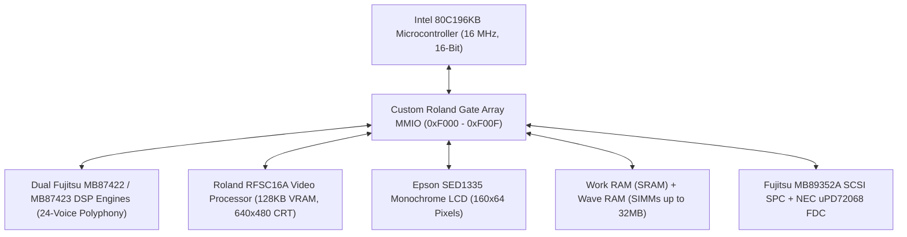
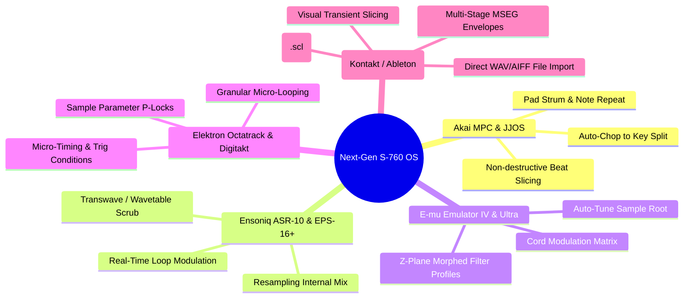
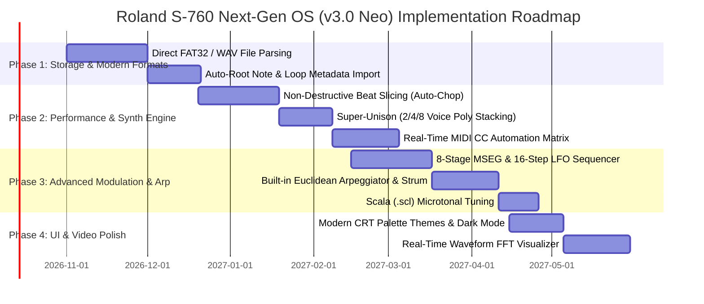

# Roland S-760 Next-Gen OS — Feature Roadmap, Modern Sampler Inspiration & Hardware Feasibility Analysis

## Executive Vision

The **Roland S-760** possesses what many producers and sound designers consider the greatest digital audio front-end and analog filtering stage in sampling history: punchy, warm AKM AK4328 18-bit DACs, pristine 48kHz linear PCM conversion, and lush 24dB/oct resonant TVF filters. 

However, its original OS (v2.24, released in 1994) was constrained by mid-90s disk conventions, menu hierarchies, and static sample playback architectures.

With our reverse-engineered binary foundation, cycle-accurate MAME emulation core, C++ DSP engine, and interactive CRT/Rack UI, we have a unique opportunity: **to design and prototype a next-generation operating system ("S-760 Neo OS / v3.0") that marries the S-760's iconic sonic character with modern sampling innovations from the last 35 years.**

---

## 1. Hardware Feasibility & Architectural Constraints

Before adding features, we must assess what the underlying S-760 hardware can and cannot execute:

### Hardware Budget Summary:
| Subsystem | Hardware Spec | Capabilities & Limits | Feasibility for Custom OS |
| :--- | :--- | :--- | :--- |
| **CPU Core** | Intel 80C196KB @ ~16 MHz | 16-bit register ALU, ~1.5–2.0 MIPS throughput. Fast register-to-register math, but cannot run complex floating-point DSP in real-time. | **Excellent for control logic, state machines, disk I/O, MIDI routing, and non-real-time offline wave rendering.** |
| **Sound DSP** | Dual Fujitsu MB87422 / MB87423 | 24-voice polyphony, dedicated hardware interpolation, pitch shifting, 4-pole 24dB TVF, TVA volume scaling, and stereo pan DAC feeding. | **Hardware voice synthesis is fixed-function ASIC.** New synthesis modes work by manipulating playback pointers, loop boundaries, and offline wave pre-calculation. |
| **Wave Memory** | Up to 32MB 72-pin SIMM RAM | Holds up to ~350 seconds of mono 44.1kHz 16-bit audio or ~175 seconds of stereo audio. Fast 16-bit parallel DMA access. | **Ample RAM capacity for slicing, multi-velocity layers, multi-sample kits, and granular buffer chunks.** |
| **Video & UI** | RFSC16A VDP (640x480 RGB) + SED1335 (160x64 LCD) | 128KB TC511664 VRAM, 10-pen hardware palette, 60Hz raster display, hardware glyph rendering. | **100% programmable.** We can build completely new graphical tools, FFT spectrum visualizers, piano rolls, and multi-stage envelope canvases. |
| **Storage & I/O** | SCSI (MB89352A) + Floppy (NEC uPD72068) + UART MIDI | High-speed SCSI bus (up to 5 MB/s with BlueSCSI/ZuluSCSI SD cards). Standard 31.25 kbaud serial MIDI. | **Massive throughput.** We can stream modern WAV/AIFF files directly from modern SD cards without proprietary disk formats. |

---

## 2. Inspiration from 35 Years of Sampler Evolution

---

## 3. High-Priority Feature Candidates & Feasibility Analysis

### Feature 1: Non-Destructive Transient Beat Slicing & Auto-Chop (MPC / Recycle Style)
- **Concept:** Take a drum loop or musical phrase, automatically detect attack transients (or set equal division grid: 8, 16, 32 slices), and automatically generate a **Patch Split** mapping each slice to sequential MIDI keys (C1, C#1, D1...).
- **How it works on S-760:** Rather than duplicating wave data, the OS creates 1 Partial per slice with custom `Start Point` and `End Point` offsets pointing to the shared master waveform in RAM.
- **Feasibility:** 🟢 **High (100% Achievable on Physical Hardware & Emulator)**
- **User Impact:** Transforms the S-760 into a breakbeat slicing powerhouse with authentic 90s analog warmth.

---

### Feature 2: Direct FAT32 / SD-Card Modern WAV / AIFF Import & Export
- **Concept:** Allow users to plug an SD card into a ZuluSCSI / BlueSCSI or Gotek drive and load standard 16-bit / 24-bit `.wav` and `.aiff` files directly from folders without converting them into proprietary Roland SYS-772 disks first.
- **How it works on S-760:** Write a lightweight FAT32 and RIFF/WAV header parser in the 80C196 OS payload. The SCSI driver reads sectors directly from FAT32 partition clusters into Wave SIMM memory.
- **Feasibility:** 🟢 **High (Fully feasible in 80C196 C/Assembly)**
- **User Impact:** Eliminates the single biggest friction point of vintage samplers (disk formatting and conversion tools).

---

### Feature 3: Transwave / Granular Wave-Scrub Synthesis (Ensoniq ASR-10 Style)
- **Concept:** Create evolving, wavetable-like pad textures by modulating the sample start/loop point in real time across a multi-cycle waveform via Mod Wheel, Velocity, or LFO.
- **How it works on S-760:** The S-760 Gate Array MMIO allows writing loop offsets during voice lifecycle. By tying the LFO or aftertouch to the sample start address register, the voice sweeps through wave cycles dynamically.
- **Feasibility:** 🟡 **Medium (Requires low-level voice MMIO latch modulation)**
- **User Impact:** Unlocks ASR-10 / PPG Wave style wavetable textures with the Roland 24dB resonant filter.

---

### Feature 4: Polyphonic Voice Stacking, Unison & Stereo Spread
- **Concept:** A dedicated "Super-Unison" mode that stacks 2, 4, or 8 voices per key with adjustable detune (cents) and dynamic stereophonic pan spread.
- **How it works on S-760:** The S-760 has 24 hardware voices. The Voice Allocator software routine can spawn multiple voice nodes per Note-On event with calculated pitch and pan offsets.
- **Feasibility:** 🟢 **High (Pure Voice Allocator software update in CPU code)**
- **User Impact:** Massive analog-style supersaws, thick multi-tracked acoustic instruments, and rich stereo chorus pads without external effects.

---

### Feature 5: Multi-Stage Complex Envelopes (MSEG) & LFO Step Modulators
- **Concept:** Expand beyond the fixed 4-point envelope into 8-stage freeform MSEGs and 16-step rhythmic LFO modulation sequences (Serum / Massive style).
- **How it works on S-760:** The 80C196 timer ISR currently calculates TVF/TVA envelope breakpoints at 60Hz. We can replace the 4-point state machine with an 8-stage breakpoint array and a 16-step modulation sequencer.
- **Feasibility:** 🟢 **High (Software timer interrupt routine update)**
- **User Impact:** Complex rhythmic gating, dubstep filter wobbles, sidechain pumping simulations, and evolving cinematic soundscapes.

---

### Feature 6: High-Resolution Real-Time MIDI CC Modulation Matrix (MIDI 2.0 / NRPN)
- **Concept:** Provide full real-time MIDI CC mapping for every synthesis parameter (Filter Cutoff, Resonance, Attack, Decay, LFO Rate, Pan, Tuning) without requiring slow SysEx packets.
- **How it works on S-760:** Intercept standard MIDI Continuous Controllers (CC 1–119) and high-resolution NRPNs in the UART interrupt routine and immediately update the Gate Array DSP parameter latches.
- **Feasibility:** 🟢 **High (Fast UART lookup table in CPU core)**
- **User Impact:** Seamless automation from modern DAWs (Ableton, Logic, Pro Tools, Reaper, FL Studio) with instant hardware knob response.

---

### Feature 7: Microtonal Tuning & Scala (.scl) Import
- **Concept:** Enable custom microtonal scales (just intonation, Indian ragas, Arabic quarter-tones, Wendy Carlos scales, Aphex Twin microtunings).
- **How it works on S-760:** The S-760 pitch engine uses a 16-bit pitch ratio lookup table. The OS can parse `.scl` text files and populate the pitch tuning matrix.
- **Feasibility:** 🟢 **High (Table-driven pitch math)**
- **User Impact:** Experimental tuning, authentic ethnic instruments, and avant-garde composition.

---

### Feature 8: Dynamic Arpeggiator & Chord Memory / Strummer Engine
- **Concept:** Built-in multi-pattern arpeggiator (Up, Down, Random, As-Played, Chord Strum) with swing/groove quantization and Euclidean rhythm generators.
- **How it works on S-760:** Implemented as a high-priority MIDI scheduler task inside the 80C196 timer event loop.
- **Feasibility:** 🟢 **High (Software task scheduler)**
- **User Impact:** Standalone performance sequencing without needing an external computer or hardware sequencer.

---

### Feature 9: Modern CRT Visual Themes & Live FFT Spectrum Analyzer
- **Concept:** Customizable CRT color palettes (Classic 10-Pen Royal Blue, Amber Phosphorus, Cyberpunk Neon Green, Monochrome Hi-Contrast) + real-time FFT frequency spectrum analyzer during sample preview.
- **How it works on S-760:** The OP-760 VDP palette RAM is fully programmable. The FFT display can be rendered via fast integer FFT on the 80C196 during sample audition.
- **Feasibility:** 🟢 **High (VDP palette update + integer math)**
- **User Impact:** Stunning visual feedback and modern accessibility options.

---

## 4. Comprehensive Roadmap & Phased Implementation Plan

---

## 5. Summary Table: Feature Feasibility & Innovation Impact

| Feature Concept | Target S-760 Subsystem | Historical Inspiration | Firmware Feasibility | Innovation Impact |
| :--- | :--- | :--- | :---: | :---: |
| **1. Beat Auto-Chop & Slice** | Patch Split / Partial Allocator | Akai MPC 2000XL / JJOS / Recycle | 🟢 **100% Feasible** | ⭐⭐⭐⭐⭐ (Massive) |
| **2. Direct WAV / SD Import** | SCSI Driver / FAT32 Parser | Modern SD / ZuluSCSI / Kontakt | 🟢 **100% Feasible** | ⭐⭐⭐⭐⭐ (Massive) |
| **3. Super-Unison & Stereo Spread** | Voice Allocator & Pan DSP | Roland JP-8000 / Access Virus | 🟢 **100% Feasible** | ⭐⭐⭐⭐ (High) |
| **4. Real-Time MIDI CC Matrix** | UART MIDI Ring Buffer & MMIO | Modern VSTs / Elektron Digitone | 🟢 **100% Feasible** | ⭐⭐⭐⭐⭐ (Massive) |
| **5. 8-Stage MSEG & Step LFO** | 80C196 Software Timer ISR | Xfer Serum / Native Instruments | 🟢 **100% Feasible** | ⭐⭐⭐⭐ (High) |
| **6. Transwave / Granular Scrub**| Loop Point MMIO Modulator | Ensoniq ASR-10 / PPG Wave | 🟡 **Medium (MMIO mod)** | ⭐⭐⭐⭐⭐ (Massive) |
| **7. Euclidean Arpeggiator** | Real-Time Event Scheduler | Elektron Octatrack / Squarp | 🟢 **100% Feasible** | ⭐⭐⭐⭐ (High) |
| **8. Scala Microtonal Import** | 16-Bit Pitch Ratio Table | Kurzweil K2500 / Aphex Twin | 🟢 **100% Feasible** | ⭐⭐⭐ (Moderate) |
| **9. CRT Themes & FFT Visualizer**| VDP 10-Pen Palette & Blitter | Modern DAWs / Fairlight CMI | 🟢 **100% Feasible** | ⭐⭐⭐⭐ (High) |
