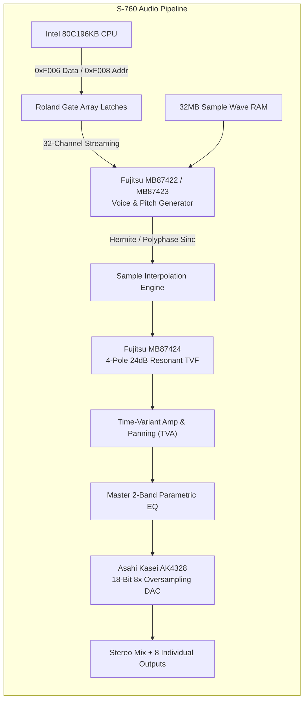

# Roland S-760 Fujitsu Audio DSP ASICs & TVF Filter Architecture

This document provides the low-level hardware specification and mathematical model for the custom **Fujitsu DSP ASICs** and the **Time-Variant Filter (TVF)** pipeline in the **Roland S-760 16-Bit Digital Sampler** (1993).

---

## 1. Subsystem Block Diagram

---

## 2. Hardware IC Identification & Roles

| IC Part Number | Designation | Package | Functional Description |
| :--- | :--- | :--- | :--- |
| **Fujitsu MB87422 / MB87423** | Voice Generation ASIC | 100-pin QFP | 32-channel phase accumulator, 24-bit Wave RAM addressing, sample loop bounds, fractional pitch stepping. |
| **Fujitsu MB87424** | TVF (Time-Variant Filter) ASIC | 100-pin QFP | 32-channel 4-pole 24dB/octave resonant digital filter engine (LPF, HPF, BPF) with envelope modulation. |
| **Asahi Kasei AK4328-VP** | Audio DAC | 28-pin SOP | 18-bit dual audio DAC with 8× oversampling digital interpolation filter and low out-of-band noise. |
| **Asahi Kasei AK5339-VS** | Audio ADC | 28-pin SOP | 16-bit 64× oversampling Delta-Sigma stereo ADC for front panel analog sampling. |

---

## 3. Gate Array DSP Streaming Protocol (`0xF006` / `0xF008`)

The Intel 80C196KB CPU configures all 32 voice channels and global DSP parameters by streaming indexed command words through two Gate Array MMIO registers:
- **`0xF008` (DSP Target Address / Channel Index):**
  - Bits 4..0: Voice Channel Index ($0..31$).
  - Bits 7..5: Parameter Register Offset ($0..7$).
- **`0xF006` (DSP Command & 16-Bit Data Port):**
  - Transfers 16-bit parameter values to the active channel register selected by `0xF008`.

### 3.1 Voice Channel Parameter Map (Per-Voice, Channels 0..31)

| Register Index | Parameter Name | Data Bitfields & Description |
| :---: | :--- | :--- |
| **`0x00`** | `PITCH_STEP_L` | Lower 16 bits of the 32-bit fractional phase increment step ($\Delta \phi$). |
| **`0x01`** | `PITCH_STEP_H` | Upper 16 bits of the 32-bit fractional phase increment step ($\Delta \phi$). |
| **`0x02`** | `WAVE_START_ADDR` | 24-bit Wave RAM start word address ($0..16,777,215$). |
| **`0x03`** | `WAVE_LOOP_START` | 24-bit Wave RAM loop start word offset. |
| **`0x04`** | `WAVE_LOOP_END` | 24-bit Wave RAM loop end word offset. |
| **`0x05`** | `VOICE_CTRL` | Bit 0: Voice Active / Note-On trigger; Bit 1: Loop Enable; Bit 2: Loop Mode (0=Forward, 1=Alternating); Bit 3: 16-bit/8-bit mode; Bits 7..4: Output Bus Assign (0=Main Stereo, 1..8=Individual Out 1..8). |
| **`0x06`** | `TVF_CTRL` | Bits 6..0: Cutoff Frequency ($0..127$); Bits 13..7: Resonance ($0..127$); Bits 15..14: Filter Mode ($00=\text{LPF}, 01=\text{BPF}, 10=\text{HPF}$). |
| **`0x07`** | `TVA_CTRL` | Bits 6..0: Voice Volume Level ($0..127$); Bits 11..7: Pan position ($-15..+15$); Bits 15..12: Envelope Stage. |

---

## 4. Mathematical Modeling

### 4.1 Fractional Phase Step & Interpolation (MB87422/23)

For a sample recorded at native rate $f_{\text{orig}}$ (e.g. $44,100\text{ Hz}$ or $22,050\text{ Hz}$) played back at MIDI note $N$ with root key $R$:

$$\text{Pitch Ratio } r = \frac{f_{\text{orig}}}{44100} \cdot 2^{\frac{N - R + \frac{\text{FineTune}}{100}}{12}}$$

$$\Delta \phi = \lfloor r \cdot 2^{16} \rfloor \quad (\text{16.16 Fixed Point Phase Step})$$

The fractional index $\mu = \text{pos} - \lfloor \text{pos} \rfloor$ interpolates between sample points using a 4-point Hermite cubic polynomial:

$$y(\mu) = c_0 + c_1 \mu + c_2 \mu^2 + c_3 \mu^3$$

$$\begin{aligned}
c_0 &= y_1 \\
c_1 &= \frac{1}{2}(y_2 - y_0) \\
c_2 &= y_0 - \frac{5}{2}y_1 + 2y_2 - \frac{1}{2}y_3 \\
c_3 &= \frac{1}{2}(y_3 - y_0) + \frac{3}{2}(y_1 - y_2)
\end{aligned}$$

---

### 4.2 MB87424 4-Pole 24dB/Octave Resonant TVF Filter

The Roland TVF is a cascaded 4-pole zero-delay feedback (ZDF) ladder / biquad topology with non-linear saturation in the feedback path:

1. **Cutoff Mapping ($0..127 \rightarrow f_c\text{ in Hz}$):**
   $$f_c = 20.0 \cdot 10^{\frac{\text{Cutoff} \cdot 3.0}{127}} \quad (\text{Logarithmic sweep } 20\text{ Hz} \rightarrow 20\text{ kHz})$$

2. **Resonance Mapping ($0..127 \rightarrow k$):**
   $$k = 3.98 \cdot \left(\frac{\text{Resonance}}{127.0}\right)^{1.4} \quad (\text{Self-oscillation occurs as } k \to 4.0)$$

3. **Discrete 4-Pole Update Equations:**
   $$\omega = 2 \pi \frac{f_c}{f_s}, \quad g = \tan\left(\frac{\omega}{2}\right)$$
   For each pole stage $m \in [1..4]$:
   $$v_m = \frac{g}{1 + g} (x_m - s_m), \quad y_m = v_m + s_m, \quad s_m \leftarrow y_m + v_m$$
   Feedback saturation with soft hyperbolic tangent limiting:
   $$x_{\text{in}} = x - k \cdot \tanh(y_4)$$
