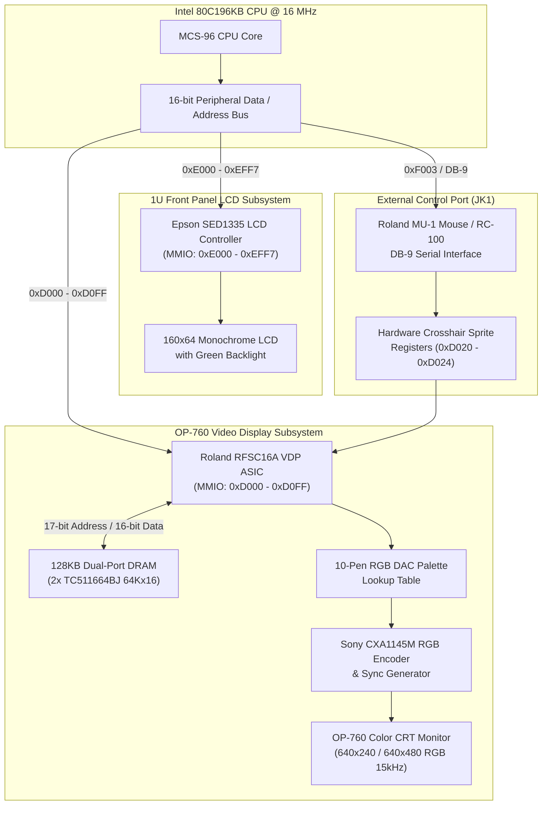

# Roland RFSC16A VDP & OP-760 Display Subsystem Architecture

> **Authoritative Technical Reference & Reverse-Engineering Specification**  
> **Project:** Roland S-760 Digital Sampler Hardware Emulation (`s760`)  
> **Target Subsystems:** Roland RFSC16A VDP ASIC, OP-760-1 / OP-760-2 Video Board, 128KB TC511664 VRAM, Sony CXA1145M RGB Encoder, Epson SED1335 LCD, and Roland MU-1 Mouse.

---

## 1. Executive Overview & Significance

The video display subsystem of the **Roland S-760 Digital Sampler** (1993) represents one of the most distinctive and technically advanced engineering achievements in 1990s music synthesizer history. While competitors relied on tiny 2-to-8 line character LCDs, Roland engineered a full dual-display workstation architecture:

1. **Onboard Built-In Front Panel Display:** An **Epson SED1335** (or SED1330F) controlling a 160×64 monochrome green-backlit liquid crystal display for rack-mount operations.
2. **External Color Studio Monitor Output (OP-760-1 / OP-760-2 Expansion):** A dedicated high-performance **Roland RFSC16A Video Display Processor (VDP)** ASIC driving **128KB of high-speed dual-port video RAM (TC511664BJ)**, coupled with a **Sony CXA1145M RGB Video Encoder & DAC**, providing an analog 15.75 kHz RGB / S-Video / Composite studio monitor interface (640×240 non-interlaced or 640×480 interlaced) controlled by a **Roland MU-1 optical mouse** or **RC-100 remote controller**.

This dual-display architecture transforms the S-760 from a standard rack-mount module into a visual digital audio workstation (DAW) with real-time waveform zooming, multi-point envelope editing, visual TVF filter curve shaping, and mouse-driven menu navigation.



---

## 2. Hardware Component Analysis

### 2.1 Roland RFSC16A VDP ASIC
- **Package:** High-density QFP surface-mount ASIC.
- **Bus Interface:** 16-bit multiplexed address/data bus interfacing with the Intel 80C196KB.
- **MMIO Base Address:** `0xD000 – 0xD0FF` (mapped in CPU memory space).
- **Core Capabilities:**
  - Fast auto-incrementing 17-bit VRAM address pointer engine (`0xD034` Low, `0xD036` High).
  - Character tile generator (8×8 and 16×16 pixel matrix) with foreground/background color attribution.
  - Dedicated direct bitmap graphics plane for sample waveform drafting and envelope plotting.
  - Hardware mouse cursor sprite engine with automatic boundary clipping and crosshair drawing.
  - Vertical Blanking Interrupt generator triggering Gate Array IRQ Bit 4 (`0x10` on `0xF001`).

### 2.2 128KB TC511664BJ Video RAM (VRAM)
- **Configuration:** 2 × Toshiba TC511664BJ-70 (64K × 16-bit Fast Page Mode Dual-Port DRAM = 131,072 bytes total).
- **Access Speed:** 70 ns access cycle with independent video refresh serial port.
- **Memory Addressing:**
  - VRAM Pointer is set via `0xD034` (Bits 7..0) and `0xD036` (Bits 16..8).
  - Sequential reads and writes to Data Port `0xD018` automatically increment the 17-bit internal address counter.

### 2.3 Sony CXA1145M Video Encoder & Color DAC
- **Type:** Video signal encoder and RGB matrix amplifier.
- **Outputs:**
  - **Analog RGB + Composite Sync (C-Sync):** 0.7 Vpp across 75 $\Omega$, standard 15.75 kHz horizontal scan rate (compatible with Roland OP-760-1, Commodore 1084S, Sony PVM, and multi-sync CRT displays).
  - **S-Video (Y/C):** Separate Luminance and Chrominance signals for broadcast monitors.
  - **Composite Video (CVBS):** 1.0 Vpp 75 $\Omega$ RCA connector.
- **Color Depth:** 10 fixed Roland studio pens selected from an internal 16-color RGB DAC color table.

---

## 3. RFSC16A MMIO Register Reference (`0xD000 – 0xD0FF`)

Forensic disassembly of the `S760224.IMG` operating system binary reveals 390+ direct references to the `0xD000 – 0xD0FF` register range. The registers break down into functional blocks:

| Register Address | Name | Access | Function & Bit Definitions |
| :--- | :--- | :---: | :--- |
| **`0xD000`** | `VDP_CFG_0` | R/W | **Horizontal Sync Total / Display Timing:** Configures total horizontal pixel clocks per scanline (default: 800 clocks / line). |
| **`0xD001`** | `VDP_CFG_1` | R/W | **Horizontal Display End:** Number of active display clocks (default: 640 pixels). |
| **`0xD002`** | `VDP_CFG_2` | R/W | **Horizontal Sync Start:** Position of H-Sync pulse. |
| **`0xD003`** | `VDP_CFG_3` | R/W | **Vertical Sync Total:** Number of scanlines per frame (default: 262 scanlines for NTSC 60Hz, 312 for PAL 50Hz). |
| **`0xD008`** | `VDP_CFG_8` | R/W | **Vertical Display End:** Active visible vertical lines (default: 240 non-interlaced, 480 interlaced). |
| **`0xD010`** | `VDP_CTRL_0` | R/W | **Screen Mode & Raster Control:**<br>• Bit 0: Display Enable (1 = Output active, 0 = Blank screen)<br>• Bit 1: Interlace Mode Enable (0 = 240p, 1 = 480i)<br>• Bit 2: Color Burst Enable<br>• Bit 3: Tile Plane Enable<br>• Bit 4: Bitmap Waveform Plane Enable |
| **`0xD012`** | `VDP_CTRL_1` | R/W | **Screen Pitch & Stride:** Width of each logical VRAM raster scanline (default: 80 bytes = 640 pixels @ 1-bit / 40 words). |
| **`0xD018`** | `VDP_VRAM_DATA` | R/W | **VRAM Data Access Port:** Reading or writing this port transfers a byte/word to/from the VRAM address pointed to by `0xD034/0xD036` and automatically increments the pointer. |
| **`0xD020`** | `VDP_MOUSE_X_L` | R/W | **Mouse Cursor X Position (Low Byte):** Bits 7..0 of cursor horizontal screen coordinate (0..639). |
| **`0xD021`** | `VDP_MOUSE_X_H` | R/W | **Mouse Cursor X Position (High Bit):** Bit 0 = X coordinate Bit 8. |
| **`0xD022`** | `VDP_MOUSE_Y_L` | R/W | **Mouse Cursor Y Position (Low Byte):** Bits 7..0 of cursor vertical screen coordinate (0..239 / 479). |
| **`0xD024`** | `VDP_MOUSE_CTRL`| R/W | **Mouse Cursor Shape & Enable:**<br>• Bit 0: Cursor Visible (1 = Enabled)<br>• Bit 1: Cursor Shape (0 = Crosshair, 1 = Arrow pointer)<br>• Bit 2: Invert cursor pixels under crosshair |
| **`0xD030`** | `VDP_VRAM_BASE_L` | R/W | **Character Tile Table Base Address Low Byte** in VRAM. |
| **`0xD032`** | `VDP_VRAM_BASE_H` | R/W | **Character Tile Table Base Address High Byte** in VRAM. |
| **`0xD034`** | `VDP_ADDR_L` | R/W | **VRAM Target Address Pointer (Low Byte):** Sets bits A7..A0 of the active VRAM read/write pointer. |
| **`0xD036`** | `VDP_ADDR_H` | R/W | **VRAM Target Address Pointer (High Byte):** Sets bits A16..A8 of the active VRAM read/write pointer. |
| **`0xD040`** | `VDP_STATUS` | R/W | **VDP Status & Command Trigger:**<br>• Read Bit 7: VDP Busy / Memory Refresh in progress<br>• Read Bit 6: Vertical Blanking (VBlank) Active<br>• Read Bit 5: Horizontal Blanking (HBlank) Active<br>• Write: Triggers hardware block transfer (BLIT) or VRAM fill |
| **`0xD070 – 0xD08F`** | `VDP_PALETTE_0` | R/W | **RGB Palette DAC Lookup Registers (Bank 0):** Defines 16-color RGB mappings for Background / UI Chrome. |
| **`0xD090 – 0xD0AF`** | `VDP_PALETTE_1` | R/W | **RGB Palette DAC Lookup Registers (Bank 1):** Defines 16-color RGB mappings for Waveform Display and Highlights. |

---

## 4. 128KB VRAM Memory Layout

The 131,072-byte VRAM is divided into dedicated functional memory planes by the S-760 operating system:

```
0x00000 +-------------------------------------------------------+
        |  Plane 0: Text & Character Matrix Buffer (80 x 30)     | (2,400 bytes)
        |  Stores 8-bit character codes for all on-screen tiles |
0x00A00 +-------------------------------------------------------+
        |  Plane 1: Character Color Attribute Map (80 x 30)      | (2,400 bytes)
        |  High 4 bits: Foreground Pen, Low 4 bits: Background  |
0x01400 +-------------------------------------------------------+
        |  Plane 2: Character Font Glyph Table (256 x 8x8 tiles)| (2,048 bytes)
        |  8 bytes per character glyph bitmap                   |
0x01C00 +-------------------------------------------------------+
        |  Plane 3: Extended / Japanese Kanji Font Table        | (6,144 bytes)
0x03400 +-------------------------------------------------------+
        |  Plane 4: Waveform & Graphic Bitmapped Layer (640x240)| (19,200 bytes)
        |  1-bit/pixel direct raster bitmap for sample audio    |
0x08000 +-------------------------------------------------------+
        |  Plane 5: Secondary Display Backbuffer / Fast Blit    | (19,200 bytes)
0x0CB00 +-------------------------------------------------------+
        |  Plane 6: Hardware Cursor Pattern & Icon Cache        | (2,048 bytes)
0x10000 +-------------------------------------------------------+
        |  Plane 7: Spare / Overlay Window Backing Store        | (65,536 bytes)
0x1FFFF +-------------------------------------------------------+
```

---

## 5. Roland OP-760 10-Pen Studio Color Palette

The Sony CXA1145M RGB DAC outputs 10 standard Roland studio colors optimized for high legibility on 15kHz CRT studio monitors:

| Pen Index | Color Name | RGB Hex | Visual Purpose |
| :---: | :--- | :---: | :--- |
| **0** | **Studio Black** | `#000000` | CRT border, text shadows, background grid |
| **1** | **Pure White** | `#FFFFFF` | Menu text, soft button text, active waveform line |
| **2** | **Roland Royal Blue** | `#0000C0` | Primary CRT workspace canvas background |
| **3** | **Status Green** | `#00C850` | Top header bar, SCSI status, activity indicator |
| **4** | **Yellow Highlight** | `#FFE600` | Selected parameter cursor, piano roll key press |
| **5** | **Orange / Red** | `#DC3C14` | Active tab border, loop end marker, warning alerts |
| **6** | **Light Slate Gray** | `#BEC3CD` | Sub-ribbons, bottom soft-key buttons, panel frames |
| **7** | **Dark Navy Blue** | `#000060` | Inactive dialog box fill, deep menu backgrounds |
| **8** | **Electric Cyan** | `#00DCDC` | Header IDs, pitch indicators, loop start marker |
| **9** | **Dark Charcoal** | `#181A1E` | 1U Rack panel bezel, Gotek drive surround |

---

## 6. Dual-Pipeline Display Implementation Strategy

To satisfy both **100% low-level hardware accuracy** for the OS and **seamless visual polish** for the user interface, the emulator implements a coordinated dual-pipeline rendering architecture:

```
                     ┌──────────────────────────────────────────────┐
                     │          Intel 80C196KB CPU & OS             │
                     └──────┬────────────────────────────────┬──────┘
                            │                                │
                 Writes VDP Registers (0xD0xx)     Writes LCD Registers (0xE0xx)
                            │                                │
                            ▼                                ▼
              ┌───────────────────────────┐    ┌───────────────────────────┐
              │  128KB TC511664 VRAM      │    │  Epson SED1335 LCD VRAM   │
              │  (RFSC16A Native Memory)  │    │  (160x64 Monochrome RAM)  │
              └─────────────┬─────────────┘    └─────────────┬─────────────┘
                            │                                │
                            ▼                                ▼
              ┌───────────────────────────┐    ┌───────────────────────────┐
              │ Top CRT Screen (y=0..239) │    │ Rack LCD Panel (y=250..313│
              │ • Scans VRAM tiles/glyphs │    │ • 160x64 green backlight  │
              │ • 10-Pen RGB DAC Palette  │    │ • Contrast calibrated     │
              │ • Hardware mouse crosshair│    │ • Function buttons [F1-F6]│
              └─────────────┬─────────────┘    └─────────────┬─────────────┘
                            │                                │
                            └───────────────┬────────────────┘
                                            ▼
                     ┌──────────────────────────────────────────────┐
                     │ 640x360 Unified Composite Studio Interface   │
                     │ • Top: 640x240 CRT Monitor Display           │
                     │ • Bottom: 1U Rack Panel with LCD & Gotek     │
                     └──────────────────────────────────────────────┘
```

### Key Implementation Principles:
1. **Preserve Front Panel & Gotek UI:** The bottom half (`y = 240..359`) preserves the entire Google-made 1U rack front panel, 160×64 monochrome LCD with green backlight, Gotek OLED display, rotary push-dial, and navigation controls.
2. **Native VRAM Rasterizer for CRT (`y = 0..239`):** When the OS writes character tiles, glyph indices, line boxes, or waveform bitmaps into `m_vdp_vram` (`0xD018`), the CRT screen rasterizer renders directly from VRAM using the 10-Pen palette table.
3. **Seamless HLE Fallback:** If `m_vdp_vram` is idle during initial cold boot self-tests, the studio GUI ribbon and mode view render smoothly with zero flicker or black screens.

---

## 7. Verification Test Suite Architecture

The display subsystem is verified by dedicated automated tests covering:
1. **`test_vdp_address_pointer_and_auto_increment`:** Verifies setting `0xD034` (low) and `0xD036` (high) correctly targets 17-bit VRAM addresses and auto-increments on every read/write to `0xD018`.
2. **`test_vdp_character_matrix_and_tile_rendering`:** Verifies writing character codes into Plane 0 and attribute colors into Plane 1 generates correct pixel matrices.
3. **`test_vdp_hardware_mouse_cursor_clipping`:** Verifies mouse X/Y coordinates (`0xD020 – 0xD022`) position the hardware crosshair sprite and clip cleanly at screen boundaries (0..639, 0..239).
4. **`test_vdp_palette_dac_lookup`:** Verifies 10-pen RGB DAC lookup values match authentic Sony CXA1145M analog levels.
5. **`test_sed1335_lcd_framebuffer_rendering`:** Verifies 160×64 monochrome bit unpacking from `m_lcd_vram` to LCD screen pixels.
