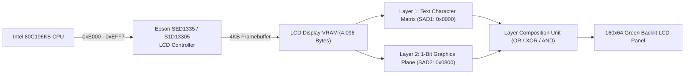

# Roland S-760 Front Panel LCD & Epson SED1335 Architecture

This document specifies the hardware architecture, register protocol, and framebuffer memory organization of the **Epson SED1335 (S1D13305)** monochrome LCD controller powering the front-panel $160 \times 64$ display of the **Roland S-760 16-Bit Digital Sampler** (1993).

---

## 1. Hardware Overview & Memory Map



- **Controller IC:** Epson SED1335F (or Seiko-Epson S1D13305F) CMOS dot-matrix LCD controller.
- **Display Resolution:** $160 \times 64$ monochrome dots (20 bytes per scanline $\times$ 64 lines = 1,280 bytes / layer).
- **CPU Interface:**
  - **`0xE000` (Data Port, $A_0 = 0$):** Read / Write display parameter bytes and VRAM stream.
  - **`0xE001` (Command / Status Port, $A_0 = 1$):** Write command instructions, read controller status flag.
- **Display Memory:** 4,096 bytes static RAM allocated into distinct text and graphic display planes.

---

## 2. Command Set Reference

| Opcode | Mnemonic | Parameters | Functional Description |
| :---: | :--- | :---: | :--- |
| **`0x40`** | `SYSTEM SET` | 8 Bytes | Configures drive mode, character width ($f_x = 8\text{ px}$), character height ($f_y = 8\text{ px}$), screen stride ($C/R = 20\text{ bytes}$), and frame rate. |
| **`0x44`** | `SCROLL` | 10 Bytes | Sets start addresses ($SAD_1, SAD_2, SAD_3$) and vertical line allocations for each display layer. |
| **`0x46`** | `CSRW` | 2 Bytes ($L, H$) | Sets the 16-bit active cursor address pointer in display memory. |
| **`0x47`** | `CSRR` | 0 (Read 2B) | Reads back the 16-bit active cursor address pointer. |
| **`0x42`** | `MWRITE` | $N$ Bytes | Streams data bytes into LCD VRAM starting at cursor address with automatic address incrementation. |
| **`0x43`** | `MREAD` | $N$ Bytes | Reads data bytes from LCD VRAM starting at cursor address with automatic address incrementation. |
| **`0x58`** | `DISP OFF` | 0 Bytes | Blanks all LCD display layers. |
| **`0x59`** | `DISP ON` | 1 Byte | Enables selected display layers ($D_1 = \text{Layer 1 Text}, D_2 = \text{Layer 2 Graphics}$). |
| **`0x5A`** | `HDOT SCR` | 1 Byte | Configures horizontal smooth pixel scrolling ($0..7\text{ pixels}$). |
| **`0x5B`** | `OVLAY` | 1 Byte | Configures display composition mode ($0 = \text{OR}, 1 = \text{XOR}, 2 = \text{AND}$) and 2-layer vs. 3-layer mode. |
| **`0x5D`** | `CSRFORM` | 2 Bytes | Sets cursor shape (underline, block, flashing rates). |

---

## 3. LCD VRAM Layout ($160 \times 64$ Dots)

The 4KB display memory is partitioned into two primary operational layers:

```
0x0000 +----------------------------------------------+
       | Layer 1: Text Character Matrix (20x8 chars)  | (160 bytes: 20 cols x 8 rows)
0x00A0 | Character Attribute & Sub-menu Buffer        |
0x0800 +----------------------------------------------+
       | Layer 2: 1-Bit Graphics Plane (160x64 dots)  | (1,280 bytes: 20 bytes/line x 64 lines)
0x0D00 | Temporary Blit & Waveform Preview Workspace   |
0x0FFF +----------------------------------------------+
```

1. **Text Matrix Layer ($SAD_1 = 0x0000$):**
   - $20 \times 8$ character matrix mapping ASCII and Roland custom glyphs through an internal $8 \times 8$ character generator ROM.
2. **Graphics Bit-Plane Layer ($SAD_2 = 0x0800$):**
   - Direct bitmap where each bit corresponds to 1 pixel ($160 \text{ pixels} / 8 = 20 \text{ bytes/row} \times 64 \text{ rows} = 1,280 \text{ bytes}$).
3. **Layer Composition:**
   $$\text{Pixel}(x, y) = \text{Layer}_1(x, y) \mathbin{\text{OP}} \text{Layer}_2(x, y) \quad (\text{OP} \in \{\text{OR}, \text{XOR}, \text{AND}\})$$
