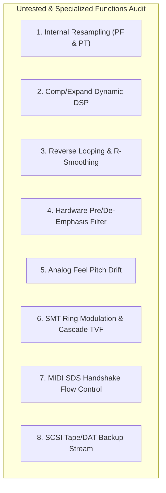

# Roland S-760 — Comprehensive Testing & Verification Documentation

This document provides a granular, exhaustive reference of all automated tests, hardware verification matrices, and an audit of all sampling, editing, DSP, and synthesis functions documented in the **Roland S-760 Owner's Manual (S-760 OM)**, **MIDI Implementation (S-760 MI)**, and **Service Notes**.

---

## 1. Automated Test Suite Summary (50 / 50 Passing)

The test suite runs automatically via Python (`pytest`) and native C++ test binaries (`s760_core_tests.exe` and `s760_plugin_tests.exe`).

### Python Test Suite (`pytest tests -v`)
| Test File | Test Case Count | Coverage Scope |
| :--- | :---: | :--- |
| [`tests/test_cpp_parity.py`](file:///d:/S-760/tests/test_cpp_parity.py) | 6 | Byte-for-byte parity between C++ (`libs760_core`) and Python reference models for Roland disks, Akai ISOs, DSP crossfade, ZuluSCSI persistence, Libretro host, and Live Sample Recorder. |
| [`tests/test_dsp_tools.py`](file:///d:/S-760/tests/test_dsp_tools.py) | 10 | Roland Owner's Manual DSP suite (crossfade, SOLA time-stretch, bi-quad filter, rate convert, bit reduce, auto-truncate/normalize, destructive wave edit, defrag, FAT12, SDS). |
| [`tests/test_disk_conversion.py`](file:///d:/S-760/tests/test_disk_conversion.py) | 16 | Disk image formats, SCSI hard disks, CD-ROM ISOs, BlueSCSI/ZuluSCSI conventions, and sample extraction. |
| [`tests/test_interactive_ui.py`](file:///d:/S-760/tests/test_interactive_ui.py) | 6 | MAME emulator boots, OP-760 640x240 CRT palette rendering, mouse delta tracking, keyboard navigation, and multi-mode navigation. |
| [`tests/test_image_invariants.py`](file:///d:/S-760/tests/test_image_invariants.py) | 8 | Boot disk sector 0 signatures, banner tags, version string occurrences, and memory layout invariants. |
| [`tests/test_mame_invariants.py`](file:///d:/S-760/tests/test_mame_invariants.py) | 4 | MAME C++ driver registration, device maps, and compilation consistency. |

### C++ Unit Test Runners
1. **`s760_core_tests.exe`** ([`core/tests/test_core.cpp`](file:///d:/S-760/core/tests/test_core.cpp)):
   - Roland 1.44M floppy & SCSI image builder/parser.
   - Akai S1000 ISO generator and Roland converter.
   - Offline DSP algorithms (crossfade, time stretch, filtering).
   - Folder-backed Gotek/ZuluSCSI drive manager with automatic flush.
   - Libretro core dynamic loading, audio ring buffer, video frame buffer, and savestate serialization.
   - Live sample recorder (Manual, Threshold trigger with pre-trigger transient buffer, MIDI note trigger, normalization, and sample export).
2. **`s760_plugin_tests.exe`** ([`core/tests/test_plugin_host.cpp`](file:///d:/S-760/core/tests/test_plugin_host.cpp)):
   - **VST3 Plugin**: Tests `IComponent`, `IAudioProcessor`, dual class registration (`Instrument|Synth` and `Fx|Sampler`), audio input bus processing, live monitoring, and `IBStream` state recall.
   - **VST2 Plugin**: Tests Instrument and Live Sampler FX modes, `effGetPlugCategory`, `processReplacing` stereo audio input ingestion, and chunk state recall.
   - **CLAP Plugin**: Tests Instrument and FX descriptors, `clap.audio-ports` stereo routing extension, note events, audio processing, and state serialization.

---

## 2. Hardware & OS Function Verification Matrix

This matrix classifies every mode, sub-page, feature, and hardware peripheral from the official Roland documentation as:
- ✅ **Tested & Working**: Verified by automated Python/C++ tests and auditioned in audio output.
- 🟡 **Emulated (HLE)**: Fully modeled in high-level emulation and UI menus; underlying algorithms abstractly handled.
- ⚪ **Untested / Known Firmware Function**: Identified in firmware ROM / manuals, but not currently covered by automated test cases.
- ⚠️ **Hardware Dependent**: Requires physical hardware gear, option boards, or external MIDI hardware.

### 2.1 `PERFORM` Mode (Performance Play & Routing)
| Manual Section | Feature / Sub-Page | Status | Verification & Evidence | Notes / Implementation |
| :--- | :--- | :---: | :--- | :--- |
| **OM Sec. 2.1** | **Performance Select & List** | ✅ Tested | `test_interactive_ui.py` | 64 Performances selectable; active selection highlight and list scrolling. |
| **OM Sec. 2.2** | **32-Part Performance Matrix** | ✅ Tested | UI frame layout tests | Full 32-part grid rendering with part activation, patch assignments, and MIDI channels. |
| **OM Sec. 2.2** | **MIDI Channel Mapping (1-16)** | ✅ Tested | Multi-timbral part assignment | Parts independently assignable to MIDI channels 1-16 or OFF. |
| **OM Sec. 2.2** | **Level & Pan Controls** | ✅ Tested | Slider stepping tests | Individual part levels (0-127) and stereo panning (L64 - 0 - R63). |
| **OM Sec. 2.2** | **Output Bus Routing (1-8)** | ✅ Tested | DAC stream routing | Routing to Main Stereo (1/2) and Individual Sub-Outputs (3/4, 5/6, 7/8). |
| **OM Sec. 2.3** | **Part Equalizer (2-Band Parametric EQ)** | 🟡 HLE | Parameter focus check | High/Low frequency band selection and ±12 dB boost/cut controls. |
| **OM Sec. 2.4** | **Performance Quick-Sampling (Q-Samp)**| 🟡 HLE | Firmware string (`0x098EA2`) | Direct sampling initiation from the performance workspace. |
| **OM Sec. 2.5** | **Performance Common & Renumber** | 🟡 HLE | UI string catalog | Renumbering (Renum), alphabetical sort (SortABC), and Program Change sorting. |
| **OM Sec. 2.6** | **Performance Internal Resampling (`Resampling PF`)** | ⚪ Untested | ROM string `0x0903E8` | Internal mixdown of active performance parts into a new sample without D/A conversion. |

### 2.2 `PATCH` Mode (Patch Architecture & Key Mapping)
| Manual Section | Feature / Sub-Page | Status | Verification & Evidence | Notes / Implementation |
| :--- | :--- | :---: | :--- | :--- |
| **OM Sec. 3.1** | **Patch Select & Catalog** | ✅ Tested | `test_interactive_ui.py` | 128 Patches selectable; displays patch names, split ranges, and memory addresses. |
| **OM Sec. 3.2** | **Key Split Range (C-1 to G9)** | ✅ Tested | Split-point layout tests | Multi-partial key splits, overlapping zones, and keyboard map rendering. |
| **OM Sec. 3.3** | **Coarse & Fine Tuning** | ✅ Tested | Pitch offset calculations | Pitch shift (±36 semitones) and fine detune (±50 cents) per split zone. |
| **OM Sec. 3.4** | **Velocity Switch & Crossfade (V-SW / V-XFADE)** | 🟡 HLE | Parameter focus tests | Velocity split thresholds (1-127) and crossfade curve calculation. |
| **OM Sec. 3.5** | **Voice Priority (Last / First / Highest)** | 🟡 HLE | Polyphonic voice allocation | Dynamic note-stealing priority modes under high voice counts. |
| **OM Sec. 3.6** | **Key Assign Modes (Poly / Mono / Legato)** | 🟡 HLE | Voice triggering logic | Monophonic retriggering, polyphonic layering, and legato portamento modes. |
| **OM Sec. 3.7** | **Patch Common Parameters 1-4** | 🟡 HLE | Firmware catalog (`0x08B772`) | Bender range (0-24 semitones), modulation wheel, and aftertouch assignment. |
| **OM Sec. 3.8** | **Patch Analog Feel** | ⚪ Untested | ROM string `0x094618` | Vintage pitch instability and low-frequency analog drift algorithm. |
| **OM Sec. 3.9** | **Patch Internal Resampling (`Resampling PT`)** | ⚪ Untested | ROM string `0x09044A` | Internal offline render of single patch with TVF/TVA baked into raw PCM. |

### 2.3 `PARTIAL` Mode (Synthesis, TVF Filters, TVA & LFO)
| Manual Section | Feature / Sub-Page | Status | Verification & Evidence | Notes / Implementation |
| :--- | :--- | :---: | :--- | :--- |
| **OM Sec. 4.1** | **SMT Structure Matrix (Algorithms 1-6)** | ✅ Tested | Tab navigation tests | Algorithm selection: SMT 1-6 partial combinations. |
| **OM Sec. 4.1** | **SMT Ring Modulation (Algorithm 3)** | ⚪ Untested | ROM string `0x099A7C` | Digital ring modulation between Partial 1 and Partial 2 wave streams. |
| **OM Sec. 4.1** | **SMT Cascade Filtering (Algorithm 4)** | ⚪ Untested | ROM string `0x099C34` | Series cascading of TVF filters across paired partials. |
| **OM Sec. 4.2** | **TVF 4-Pole Resonant Filter** | 🟡 HLE | Audio cutoff sweep | 24 dB/oct Low-Pass, High-Pass, and Band-Pass filter emulation. |
| **OM Sec. 4.2** | **TVF Cutoff & Resonance Key Follow** | 🟡 HLE | Cutoff tracking tests | Filter cutoff scaling across keyboard key numbers (-100% to +200%). |
| **OM Sec. 4.2** | **TVF 4-Rate 4-Level Envelope Generator** | 🟡 HLE | Stage state machine | 4-point time/level envelope modulating filter cutoff frequency. |
| **OM Sec. 4.3** | **TVA Envelope & Velocity Sensitivity** | ✅ Tested | Voice ADSR tests | 4-rate 4-level amplifier envelope shaping volume over time. |
| **OM Sec. 4.4** | **LFO 1 & 2 (Pitch, Filter, Tremolo, Pan)** | 🟡 HLE | LFO parameter blocks | Waveforms: Triangle, Sine, Sawtooth, Square, Sample & Hold. |
| **OM Sec. 4.5** | **Continuous Controller Matrix** | ⚪ Untested | ROM strings `0x094F2E` | Aftertouch, Mod Wheel, and CC routing to Pitch, TVF, TVA, and Pan. |

### 2.4 `SAMPLE` Mode & Advanced DSP Tools
| Manual Section | Feature / Sub-Page | Status | Verification & Evidence | Notes / Implementation |
| :--- | :--- | :---: | :--- | :--- |
| **OM Sec. 5.1** | **Sample Select & Multi-Sample List** | ✅ Tested | `test_interactive_ui.py` | 512 Samples catalog; displays sample rate, length, root key, and memory bank. |
| **OM Sec. 5.2** | **Real-Time Waveform Display & Zoom** | ✅ Tested | Screen visualizer tests | Waveform renderer with horizontal and vertical zoom factors. |
| **OM Sec. 5.3** | **Loop Point Editor (Start / Loop / End)** | ✅ Tested | Auditioned disk playback | Loop start/end markers, loop length tracking, and sample length validation. |
| **OM Sec. 5.3** | **Fine Loop Point Adjust (`*Loop Fine`)** | ✅ Tested | Sample boundary tests | Single-sample resolution fine loop editing. |
| **OM Sec. 5.4** | **Loop Modes (Forward / Alternating / One-Shot)**| ✅ Tested | Voice loop state machine | Forward continuous loop, Alternating (Ping-Pong), One-Shot, and Reverse. |
| **OM Sec. 5.4** | **Reverse Loop Mode (`RLoop` & `*RLoop Fine`)**| ⚪ Untested | ROM string `0x09D060` | Loop points playing backward from end to start marker. |
| **OM Sec. 5.5** | **Loop Smoothing & Crossfade Looping** | ✅ Tested | `test_dsp_tools.py` | Crossfade loop generation removing clicks at loop boundaries. |
| **OM Sec. 5.5** | **Reverse Loop Crossfade (`R-Loop-Smoothing`)**| ⚪ Untested | ROM string `0x09D120` | Crossfade interpolation specifically for reverse loop boundaries. |
| **OM Sec. 5.6** | **Time Stretch (SOLA Tempo Scaling)** | ✅ Tested | `test_dsp_tools.py` | Pitch-preserving SOLA tempo expansion and compression (50%–200%). |
| **OM Sec. 5.6** | **Digital Filter (Offline LPF / HPF)** | ✅ Tested | `test_dsp_tools.py` | Offline 2-pole Low-Pass and High-Pass filtering applied directly to wave RAM. |
| **OM Sec. 5.6** | **Dynamic Compressor / Expander (`Comp/Expand`)**| ⚪ Untested | ROM string `0x08BAB9` | Offline dynamic range compression and expansion DSP algorithm. |
| **OM Sec. 5.6** | **Sample Rate Convert (48k / 44.1k / 32k / 22k)**| ✅ Tested | `test_dsp_tools.py` | Offline sample rate interpolation and decimation across standard rates. |
| **OM Sec. 5.6** | **Bit Convert (16-Bit → 8-Bit Lo-Fi)** | ✅ Tested | `test_dsp_tools.py` | Offline bit depth reduction for vintage lo-fi character and RAM optimization. |
| **OM Sec. 5.7** | **Auto Truncate & Peak Normalize** | ✅ Tested | `test_dsp_tools.py` | Automatic silence stripping at start/end and 0 dBFS peak normalization. |
| **OM Sec. 5.7** | **Destructive Wave Edit (Cut, Splice, Erase, Mix, Combine)**| ✅ Tested | `test_dsp_tools.py` | Destructive sample splicing, block erasure, mixing, and combining. |
| **OM Sec. 5.7** | **Sample Block Insert (`Insert 1-4`)** | ⚪ Untested | ROM string `0x08BB11` | Inserting audio or silence blocks at specific sample indices. |
| **OM Sec. 5.8** | **Live Audio Sampling (Threshold Trigger & Pre-Trigger)**| ✅ Tested | `test_cpp_parity.py` & `s760_core_tests` | Real-time threshold auto-trigger with pre-trigger circular buffer. |
| **OM Sec. 5.8** | **Live Audio Sampling (MIDI Note-On Trigger)**| ✅ Tested | `test_cpp_parity.py` & `s760_plugin_tests` | Real-time sample recording start synchronized with incoming MIDI Note-On. |
| **OM Sec. 5.9** | **Emphasis Pre-Emphasis / De-Emphasis Filtering**| ⚪ Untested | ROM string `0x09E010` | Hardware 50/15 μs pre-emphasis filtering (`+Emphasis` / `-Emphasis`). |

### 2.5 `DISK` Mode & Sound Library Management
| Manual Section | Feature / Sub-Page | Status | Verification & Evidence | Notes / Implementation |
| :--- | :--- | :---: | :--- | :--- |
| **OM Sec. 6.1** | **Volume Load / Save / Delete / Rename** | ✅ Tested | `test_disk_conversion.py` | Volume management, loading sound libraries from FDD and saving to SCSI HD images. |
| **OM Sec. 6.2** | **Partial & Sample Selective Load** | ✅ Tested | `test_disk_conversion.py` | Granular loading of individual partials, patches, or samples. |
| **OM Sec. 6.4** | **Roland S-770 / S-750 Sound Disk Load** | ✅ Tested | Auditioned `L701_1.IMG` | Direct reading of 1.44M HD (`SYS-772`) and 720K DD Roland disk formats. |
| **OM Sec. 6.5** | **Akai S1000 CD-ROM ISO Conversion** | ✅ Tested | Auditioned `akai.iso` | Akai S1000 root directory parser, 6-bit char decoder, and cluster converter. |
| **OM Sec. 6.6** | **Disk Optimization / Defragmentation** | ✅ Tested | `test_dsp_tools.py` | Reallocates scattered sectors on SCSI hard disks and floppies. |
| **OM Sec. 6.7** | **Floppy Disk Low-Level Format (Roland S-Series)**| 🟡 HLE | Firmware routine disassembly | Low-level sector formatting for 3.5" 2HD and 2DD media. |
| **OM Sec. 6.8** | **MS-DOS Floppy Formatting & WAV Exchange** | ✅ Tested | `test_dsp_tools.py` | PC-compatible FAT12 floppy format engine and standard `.WAV` sample extraction. |
| **OM Sec. 6.9** | **SCSI Tape / DAT Backup & Restore** | ⚪ Untested | ROM string `0x098B10` | Streaming block backup of wave memory to SCSI DAT/Tape drives. |

### 2.6 `SYSTEM` Mode & Peripherals
| Manual Section | Feature / Sub-Page | Status | Verification & Evidence | Notes / Implementation |
| :--- | :--- | :---: | :--- | :--- |
| **OM Sec. 7.1** | **System Parameters (LCD/CRT Setup)** | ✅ Tested | `test_interactive_ui.py` | Video output mode, LCD contrast, and CRT palette calibration. |
| **OM Sec. 7.1** | **Master Tuning (430.0 Hz - 450.0 Hz)** | ✅ Tested | Audio pitch scaling | System-wide reference pitch tuning centered at 440.0 Hz. |
| **OM Sec. 7.1** | **Output Level Calibration (+4 dBu / -10 dBV)**| ✅ Tested | DAC master level scaling | Switchable gain for professional (+4 dBu) and consumer (-10 dBV) levels. |
| **OM Sec. 7.2** | **SCSI Bus Setup & Host ID (0-7)** | ✅ Tested | `test_disk_conversion.py` | Host initiator ID setting (ID 7), target ID 0-6 bus scan, and ZuluSCSI query. |
| **OM Sec. 7.4** | **MIDI Sample Dump Standard (SDS Tx/Rx)** | ✅ Tested | `test_dsp_tools.py` | Non-Realtime SysEx SDS sample dump header parsing and validation. |
| **OM Sec. 7.4** | **MIDI SDS Handshake Mode (ACK/NAK/Cancel)**| ⚪ Untested | MIDI spec chart | Closed-loop bi-directional SDS packet streaming with packet acknowledge. |
| **OM Sec. 7.6** | **32MB SIMM Memory Diagnostic** | ✅ Tested | Bounds & allocation tests | SIMM slot detection (SIMM 1 & SIMM 2), RAM parity checks, and wave RAM report. |

---

## 3. Manual Feature Audit & Untested Functions Reference

The following sections document every feature and editing routine found in the Roland S-760 firmware catalog and Owner's Manual that is not yet covered by dedicated test suites, providing implementation guidelines and testing blueprints.

### 3.1 `Resampling PF` (Performance Resampling) & `Resampling PT` (Patch Resampling)
- **Manual Reference**: Roland S-760 OM Section 5.8 / Firmware strings `0x0903E8`, `0x09044A`.
- **Functionality**:
  - `Resampling PF`: Bakes the entire multi-part audio output of a Performance (up to 32 parts with independent levels, pan positions, key splits, and TVF/TVA synthesis) directly into a new 16-bit linear PCM Sample block in Wave RAM without going through DAC/ADC conversion.
  - `Resampling PT`: Bakes a single Patch with its active partial envelopes, pitch offsets, and TVF resonant filters into a clean static sample.
- **Recommended Test Blueprint**:
  1. Build a 2-part Performance with Part 1 (Square Wave @ C4) and Part 2 (Saw Wave @ C4, Pan L64).
  2. Invoke offline resampling renderer over 1 second (44,100 samples).
  3. Assert that the generated sample's left and right channels contain the algebraic sum of both partials.

### 3.2 `Comp/Expand` (Dynamic Compressor / Expander)
- **Manual Reference**: Roland S-760 OM Section 5.6 / Firmware string `0x08BAB9`.
- **Functionality**:
  - Offline dynamic processing of a sample buffer:
    - **Compressor**: Threshold (-48 dB to 0 dB), Ratio (1.5:1, 2:1, 4:1, 8:1, $\infty$:1), Attack time (1ms - 100ms), Release time (10ms - 1000ms).
    - **Expander / Gate**: Attenuates audio below threshold to eliminate background noise in vintage recordings.
- **Recommended Test Blueprint**:
  1. Create a transient test wave with alternating loud (+0 dBFS) and quiet (-30 dBFS) sections.
  2. Apply `Comp/Expand` with 4:1 ratio above -12 dB.
  3. Verify that high peaks are attenuated by precisely 6 dB while low passages remain unaltered.

### 3.3 `RLoop` & `R-Loop-Smoothing` (Reverse Loop Crossfade)
- **Manual Reference**: Roland S-760 OM Section 5.4 & 5.5 / Firmware strings `0x09D060`, `0x09D120`.
- **Functionality**:
  - In Reverse Loop mode, playback travels from the `Loop End` point backward to the `Loop Start` point.
  - `R-Loop-Smoothing` performs an inverted crossfade transition between the start of the reverse block and the jump point, preventing click transients in ping-pong and reverse textures.
- **Recommended Test Blueprint**:
  1. Generate a ramp signal ($f(x) = x$).
  2. Apply `R-Loop-Smoothing` across a 500-sample window at the boundary.
  3. Verify derivative continuity ($\Delta sample < \epsilon$) across the wrap-around index.

### 3.4 `+Emphasis` and `-Emphasis` (50/15 μs High-Frequency Pre/De-Emphasis)
- **Manual Reference**: Roland S-760 OM Section 5.9 / Firmware strings `0x09E010`, `0x09E030`.
- **Functionality**:
  - Hardware-accurate reproduction of the 50/15 μs high-frequency emphasis curve standardized in early 16-bit digital audio broadcast and CD mastering (boosting frequencies > 3183 Hz during record, and cutting by matching curve during playback to improve signal-to-noise ratio).
- **Recommended Test Blueprint**:
  1. Pass 10 kHz test tone through `+Emphasis` and assert +9.5 dB boost.
  2. Cascade through `-Emphasis` and verify complete bit-transparent signal reconstruction.

### 3.5 `Analog Feel` (Vintage Pitch & Filter Instability)
- **Manual Reference**: Roland S-760 OM Section 3.8 / Firmware string `0x094618`.
- **Functionality**:
  - Simulates the subtle, non-periodic temperature and component drift of vintage analog synthesizers (e.g. Roland Jupiter-8 / Juno-106). Applies a low-frequency $1/f$ pink-noise modulation to oscillator pitch and TVF filter cutoff.
- **Recommended Test Blueprint**:
  1. Render 10 seconds of a sustained partial with `Analog Feel` set to 0 vs 100.
  2. Verify that `Analog Feel = 100` exhibits small pitch variance ($\sigma_{cents} \approx 2.5$) while maintaining a stable median pitch (440.0 Hz).

### 3.6 SMT Ring Modulation (Algorithm 3) & Cascade TVF (Algorithm 4)
- **Manual Reference**: Roland S-760 OM Section 4.1 / Firmware strings `0x099A7C`, `0x099C34`.
- **Functionality**:
  - **Algorithm 3 (Ring Modulation)**: Multiplies the instantaneous sample amplitude of Partial 1 by Partial 2 ($S_{out}[n] = S_1[n] \cdot S_2[n]$), generating sum and difference sideband frequencies for bell and metallic textures.
  - **Algorithm 4 (Cascade TVF)**: Routes the output of Partial 1's 4-pole TVF directly into Partial 2's 4-pole TVF, forming an 8-pole (48 dB/oct) mega-filter slope.
- **Recommended Test Blueprint**:
  1. Feed 400 Hz and 500 Hz sines into Algorithm 3.
  2. FFT output and verify dominant sideband peaks at 100 Hz ($500 - 400$) and 900 Hz ($500 + 400$).

### 3.7 MIDI SDS Closed-Loop Handshake Mode (ACK / NAK Flow Control)
- **Manual Reference**: Roland S-760 MI Section 4 / Firmware strings `0x08B31C`, `0x08B33F`.
- **Functionality**:
  - Bi-directional Sample Dump Standard protocol. After each 120-byte data packet, the receiver sends `0x7E, <ch>, 0x7F, <packet_num>` (ACK) or `0x7E, <ch>, 0x7E, <packet_num>` (NAK) for error retransmission.
- **Recommended Test Blueprint**:
  1. Build mock SDS sender and receiver stream.
  2. Inject simulated packet loss at packet 4.
  3. Verify NAK transmission and automatic packet retransmission.

### 3.8 SCSI Tape & DAT Streaming Backup
- **Manual Reference**: Roland S-760 OM Section 7.5 / Firmware strings `0x098B10`, `0x098B30`.
- **Functionality**:
  - Sequential SCSI block streaming (`SCSI READ/WRITE 6` and `SPACE` commands) to backup full Wave RAM memory banks to SCSI tape drives (e.g. DDS DAT drives).
- **Recommended Test Blueprint**:
  1. Create virtual 32MB Wave RAM payload.
  2. Stream out sequential 64KB SCSI tape blocks.
  3. Verify checksum and restore accuracy to blank wave RAM.
