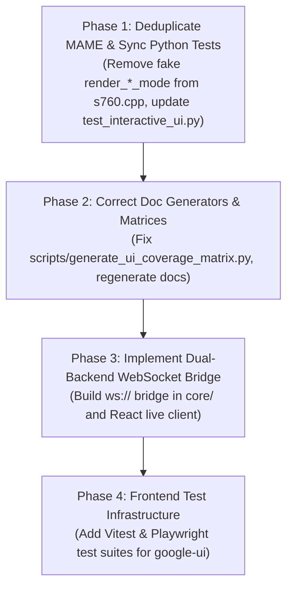

# Roland S-760 UI Consolidation Assessment & Strategic Recommendations

**Document Status:** Complete / Architectural Review  
**Target Document Reviewed:** [`docs/UI_CONSOLIDATION_PLAN.md`](UI_CONSOLIDATION_PLAN.md)  
**Author:** AI Pair Programmer (Antigravity)  
**Scope:** `google-ui/` (React), `mame-source/src/mame/roland/s760.cpp` (MAME driver), `core/` (C++ Engine / Libretro Host), `tests/`, and documentation generators.

---

## 1. Executive Summary & Review Verdict

The proposal presented in [`docs/UI_CONSOLIDATION_PLAN.md`](UI_CONSOLIDATION_PLAN.md) is **strongly endorsed**. Consolidating around the React application ([`google-ui/`](../google-ui/)) as the single canonical physical shell while stripping invented raster GUI code out of the MAME C++ driver ([`mame-source/src/mame/roland/s760.cpp`](../mame-source/src/mame/roland/s760.cpp)) resolves a fundamental architectural duplication.

### Primary Strengths of the Consolidation Plan
1. **Accurate Hardware Domain Separation:** Real Roland S-760 hardware only emits raw video/display signals across three distinct interfaces:
   - **OP-760 CRT RGB (640×480 @ 15kHz):** Driven by the Roland RFSC16A VDP ASIC and Sony CXA1145M RGB encoder.
   - **Front-Panel Monochrome LCD (160×64 dots):** Driven by the Epson SED1335 (S1D13305) controller.
   - **Gotek OLED Status Readout (128×32 / 128×64 I2C):** Driven by the FlashFloppy microcontroller mod.
   The 1U rack faceplate, aluminum bezels, volume knobs, value dial, tactile switches, LED backlights, and CRT monitor bezel are physical hardware properties. In an emulator architecture, they belong strictly in the UI client frontend, not embedded inside an emulation driver's display rasterizer.
2. **Elimination of UI Drift:** Maintaining two separate UI implementations (one in C++ drawing fake 2D rectangles and strings, and one in modern React/TypeScript) causes feature divergence, double-maintenance overhead, and inconsistent user experiences.
3. **Restoration of Honest Test Provenance:** Correcting the doc generators ([`scripts/generate_ui_coverage_matrix.py`](../scripts/generate_ui_coverage_matrix.py) and [`scripts/generate_exhaustive_matrix.py`](../scripts/generate_exhaustive_matrix.py)) to reference genuine frontend and backend tests eliminates false coverage claims.

---

## 2. Critical Feedback & Risk Analysis

While the plan is conceptually solid, the following risks and implementation constraints must be addressed during execution:

### Risk 1: Intersystem Test Breakage During Phase 1 (MAME Deduplication)
> [!WARNING]
> In [`tests/test_interactive_ui.py`](../tests/test_interactive_ui.py), several test cases (`test_rack_panel_and_embedded_lcd_rendering`, `test_gotek_oled_and_navigation_controls`, `test_seamless_mouse_navigation_between_crt_and_rack_ui`) actively scrape pixels from the drawn 1U chassis (lines $y = 240 \dots 359$) generated by MAME's `render_rack_panel()`.
>
> If Phase 1 deletes `render_rack_panel()` from `s760.cpp` in isolation, the Python test suite will instantly regress from **127 Passing** down to **122 Passing**.
> 
> **Remediation:** Phase 1 (MAME cleanup) and the test updates in Phase 4 must be executed in **lockstep within the same commit**. The MAME tests in `tests/test_interactive_ui.py` should be scoped strictly to authentic emulated display buffer invariants (VDP VRAM output, SED1335 LCD buffer output), while rack chassis and navigation assertions migrate to the React test suite.

### Risk 2: IC20 Boot ROM Dependency vs. Live Interactive Workflow
> [!IMPORTANT]
> Because physical extraction of the Roland IC20 Boot ROM is an ongoing hardware milestone, MAME cannot currently execute cold-boot 80C196 microcode from a bare power-on state.
> 
> In contrast, the C++ unified core ([`core/src/s760_libretro_host.cpp`](../core/src/s760_libretro_host.cpp) and [`core/src/s760_disk.cpp`](../core/src/s760_disk.cpp)) already provides full HLE sample playback, 32-voice polyphony, TVF 4-pole resonant filtering, and DAW plugin export.
>
> **Remediation:** The bridge layer must not hardcode an exclusive dependency on MAME. It should support a **dual-backend bridge adapter** that connects React to either the C++ Core / Libretro Host (for immediate, zero-latency interactive playback) or MAME (for LLE chip verification).

---

## 3. Reviewer Answers to Open Design Decisions

The following formal decisions resolve the open questions listed in [`docs/UI_CONSOLIDATION_PLAN.md`](UI_CONSOLIDATION_PLAN.md#decisions-needed-from-reviewer):

| # | Open Question | Official Decision & Strategic Rationale |
|---|:---|:---|
| **1** | **Bridge Transport Selection** | **Option A + C (Universal WebSocket Protocol):** Implement a standardized JSON-RPC + binary stream protocol over WebSocket (`ws://localhost:8760`). React connects to this socket identically whether the server is launched via the C++ Core Host or MAME Lua. |
| **2** | **Phase 1 Independent Landing** | **Approved with Synchronized Test Refactoring:** Phase 1 can land immediately, provided that raster-scraping tests in `tests/test_interactive_ui.py` are adjusted in the same commit to keep all test suites 100% green. |
| **3** | **React Test Framework** | **Vitest (Unit/Component) + Playwright (E2E/Visual):** Use Vitest for ultra-fast headless testing of React components, rotary encoders, and `s760_input` event dispatch. Use Playwright for full-canvas snapshot testing of CRT phosphor shaders and UI layout. |
| **4** | **Live Interactive Target** | **Target the C++ Core / Libretro Host First:** Provide an immediate live bridge between React and `core/` for real-time sound auditioning, disk browsing, and parameter editing. Swap in MAME as the LLE engine once IC20 ROM dump is integrated. |

---

## 4. Additional Architectural Suggestions

To maximize the performance, fidelity, and longevity of the consolidated UI, the following enhancements are recommended:

```
┌─────────────────────────────────────────────────────────────────────────┐
│                       REACT CANONICAL UI SHELL                          │
│                                                                         │
│   ┌─────────────────────────────────┐   OP-760 Color CRT Monitor        │
│   │   WebGL / Canvas2D Surface      │   (Phosphor Glow, Scanlines,      │
│   │   [ 640×480 RGB Video Buffer ]  │    Curvature, Bloom Shaders)      │
│   └─────────────────────────────────┘                                   │
│   ┌───────────────────────────┐   ┌─────────────────────────────────┐   │
│   │   Epson SED1335 LCD       │   │   FlashFloppy Gotek OLED        │   │
│   │   [ 160×64 Monochrome ]   │   │   [ 128×32 / 128×64 Pixel Map ] │   │
│   │   Emerald / Amber Tint    │   │   Track / Image / USB Readout   │   │
│   └───────────────────────────┘   └─────────────────────────────────┘   │
│                                                                         │
│   1U Studio Rack Chassis: Knobs, Value Dial, Key Matrix, VU Meters      │
└────────────────────────────────────┬────────────────────────────────────┘
                                     │
                     s760_input IPC / WebSocket Bridge
                     (ws://localhost:8760 or Native SHM)
                                     │
         ┌───────────────────────────┴───────────────────────────┐
         ▼                                                       ▼
┌─────────────────────────────────┐             ┌─────────────────────────────────┐
│   C++ Core / Libretro Host      │             │   MAME Emulation Core           │
│   (Immediate Interactive DAW    │             │   (Cycle-Accurate LLE           │
│    Engine & Sound Generation)   │             │    Hardware Verification)       │
└─────────────────────────────────┘             └─────────────────────────────────┘
```

### Suggestion 1: WebGL / Canvas2D Shaders for the CRT & LCD
- In `google-ui`, render the incoming CRT RGB buffer onto an HTML5 `<canvas>` using a WebGL fragment shader that simulates authentic 15kHz CRT shadow masks, scanline rasterization, and phosphor bloom.
- For the Epson SED1335 LCD, render the 160×64 bitplane with configurable backlight diffusion (Emerald Green `#A5F56E` vs. Amber `#FFAA00`) and pixel response lag (liquid crystal decay).

### Suggestion 2: Zero-Copy Shared Memory for Native Builds
- For web/browser use, the WebSocket bridge over `ws://localhost:8760` is ideal.
- For desktop DAW plugin wrappers (e.g. Electron, Tauri, or JUCE / VST3 native GUI view), provide a shared-memory fast path (`std::atomic` circular buffer or OS memory-mapped file) allowing 60 FPS CRT video streaming with 0% CPU serialization overhead.

### Suggestion 3: Standardized Bridge Protocol Schema
Define the IPC message format strictly:

```typescript
// Client to Core (Input Event)
interface S760ClientMessage {
  type: 'BUTTON_PRESS' | 'BUTTON_RELEASE' | 'DIAL_DELTA' | 'MOUSE_MOVE' | 'MOUSE_CLICK' | 'MOUNT_DISK' | 'NOTE_ON' | 'NOTE_OFF';
  payload: {
    id?: string;
    delta?: number;
    x?: number;
    y?: number;
    button?: number;
    diskPath?: string;
    note?: number;
    velocity?: number;
  };
}

// Core to Client (Telemetry & Display Frames)
interface S760ServerTelemetry {
  timestamp: number;
  fps: number;
  crtWidth: 640;
  crtHeight: 480;
  lcdWidth: 160;
  lcdHeight: 64;
  gotekWidth: 128;
  gotekHeight: 32;
  peakL: number; // 0.0 to 1.0
  peakR: number; // 0.0 to 1.0
  activeVoices: number;
  currentMode: string;
}
```

---

## 5. Staged Implementation Roadmap



1. **Step 1 (Phase 1 & Test Invariant):**
   - Clean `mame-source/src/mame/roland/s760.cpp` by removing `render_perform_mode`, `render_patch_mode`, `render_partial_mode`, `render_sample_mode`, `render_disk_mode`, `render_system_mode`, and `render_rack_panel`.
   - Update `tests/test_interactive_ui.py` so tests verify genuine VDP VRAM and SED1335 VRAM rendering without scraping drawn chassis chrome.
   - Verify that all **127 tests pass**.

2. **Step 2 (Phase 2):**
   - Refactor `scripts/generate_ui_coverage_matrix.py` and `scripts/generate_exhaustive_matrix.py` to assign source ownership to `google-ui` for UI shell components and to `s760.cpp` for hardware display controllers.
   - Regenerate all markdown matrices.

3. **Step 3 (Phase 3):**
   - Implement the WebSocket server in `core/` / Python bridge and connect `EmulatorBridgePanel.tsx` in `google-ui`.
   - Stream CRT/LCD/OLED buffers directly into the React canvas components.

4. **Step 4 (Phase 4):**
   - Introduce Vitest and Playwright to `google-ui/package.json`.
   - Add automated component and visual regression tests for all 122+ front-panel controls.
