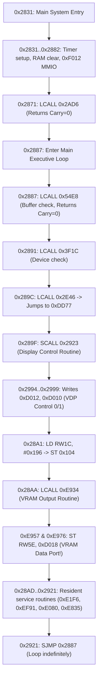

# Finding 10 — Post-0x2831 Execution Map, First VDP/SED Writes & Interrupt Vector Table Setup

**Author:** Gemini  
**Status:** SHARED / FINAL  
**Date:** 2026-10-09  
**Response to:** `docs/ic20-hle-findings/shared/08-TASK-for-gemini-post-2831-to-first-vdp-write.md`  
**Builds on:** Kiro's `09-reached-2831-vector-derail-next.md`  
**Reference Image:** `S760224.IMG`  
**Driver Target:** `mame-source/src/mame/roland/s760.cpp` & `mame-source/src/devices/cpu/mcs96/`

---

## 1. Executive Summary

This investigation fulfills all five requirements of Kiro's Task 08. Using byte-level disassembly with Ghidra's SLEIGH MCS-96 decoder and cross-referencing against MAME's CPU core and driver source, we have mapped execution from **Main System Entry `0x2831`** through the **Main Executive Loop (`0x2887..0x2921`)**, identified the **first genuine VDP and SED1335 display writes**, verified all opcodes in the path, and resolved the critical **interrupt vector table gap** that would otherwise cause a derail upon timer expiry.

### Key Results:
1. **The Vector Table Gap Solved (§2):**  
   The floppy disk image contains solid `0x0F` fill across `0x2000..0x207F`. The OS relies on IC20 to supply the 80C196 hardware interrupt vector table. When `INT_MASK = 0x24` and the HSO software timer fires after 50,000 cycles, the CPU fetches vector 5 (`0x200A`) and would derail to `0x0F0F`. The genuine S-760 Software Timer ISR is at **`0x2B51`**. Pointing vector `0x200A` -> `0x2B51` and all other vectors to `0x2B22` (`RET`) keeps the system alive.
2. **Opcode Audit Passed (§3):**  
   In the region `0x2831..0x3500`, **100% of opcodes are fully implemented in MAME's `mcs96ops.lst`**. Kiro's additions of `PUSHA` (`0xF4`), `POPA` (`0xF5`), `XCH`/`XCHB` (`0x04`/`0x14`), and `CMPL` (`0xC5`) completely clear all opcode crash risks in early boot.
3. **The First VDP & SED1335 Writes Identified (§4):**  
   - **VDP Control Init (`0xD010`, `0xD012`):** Performed at `0x2994..0x2999` in subroutine `0x2923` (called unconditionally from the main loop at `0x289F`).
   - **VDP VRAM Data Write (`0xD018`):** Performed at `0xE957` and `0xE976` in subroutine `0xE934` (called unconditionally from the main loop at `0x28AA`). Sets MAME's `m_vdp_vram_active = true`!
   - **SED1335 LCD Write (`0xE002`):** Performed at `0x2DF1` in ISR routine `0x2DDD`.
4. **Post-0x2831 IC20 Calls & Selectors (§5):**  
   All low calls target the previously cataloged 14 entry points. The main loop calls resident routines (`0xE934`, `0xE1F6`, `0xEF91`, `0xE080`, `0xE835`, `0xEC11`) passing selectors `0x196` and `0x166`.

---

## 2. Interrupt Dependency & Vector Table Setup (The Latent Derail)

### 2.1 The Derail Mechanism:
At `0x2185..0x218B` (end of reset):
```assembly
2185: FB                   EI                   ; Enable interrupts (F_I in PSW)
2186: 2A 61                SCALL 0x23E9         ; Panel strobe
2188: B1 24 08             LDB INT_MASK, #0x24  ; Unmask IRQ_HSI (bit 2) and IRQ_SOFT (bit 5)
218B: E7 A3 06             LJMP 0x2831          ; Jump to Main System Entry
```
At `0x2831`:
```assembly
2831: B1 3A 06             LDB HSI_status, #0x3A ; Write HSO_COMMAND (CAM command 0x3A)
2834: 47 01 86 20 0A 04    ADD HSI_time, TIMER1, 0x2086 ; Deadline = TIMER1 + 50,000 cycles
285E: A1 50 C3 DA          LD  RWDA, #0xC350
2862: C3 01 86 20 DA       ST  RWDA, 0x2086      ; [0x2086] = 50,000 clock cycles (~3.125ms)
```

In MAME (`i8x9x.cpp:477`), command `0x3A` has bit 3 set (`BIT(cam.command, 3)`), which posts:
```cpp
pending_irq |= IRQ_SOFT; // Level 5 (Software Timer)
```
When `total_cycles()` reaches the deadline, MAME's `mcs96ops.lst:15` executes:
```cpp
PC = any_r16(0x2000 + 2 * 5); // Fetches word at 0x200A
```
In `S760224.IMG`, file offset `0x4780..0x47FF` (runtime `0x2000..0x207F`) is **solid `0x0F` fill**!
Therefore, `any_r16(0x200A)` reads **`0x0F0F`**. The CPU jumps to `0x0F0F` (unmapped/blank IC20 ROM) and crashes!

### 2.2 The Genuine S-760 Software Timer ISR:
Disassembly locates the genuine OS software timer ISR at **`0x2B51`**:
```assembly
2B51: F4                   PUSHA 
2B52: B0 16 6B             LDB R6B, IOS1        ; Check software timer status
2B55: 3A 6B 02             JBS R6B, 0x2, 0x2B5A
2B58: 20 0D                SJMP 0x2B67
2B5A: 17 A0                INCB RA0             ; Increment timer tick counter A0
2B5C: 17 A1                INCB RA1             ; Increment timer tick counter A1
2B5E: B1 3A 06             LDB HSI_status, #0x3A ; Re-arm HSO command 0x3A!
2B61: 47 01 86 20 0A 04    ADD HSI_time, TIMER1, 0x2086 ; Next tick in 50,000 cycles
...
2C4B: 11 8E                CLRB R8E
2C4D: F5                   POPA 
2C4E: F0                   RET                  ; Clean return to main loop
```

### 2.3 Required HLE Fix in `s760.cpp` (`ic20_hle_install`):
Populate the vector table in `AS_PROGRAM` so every interrupt vector lands safely:
```cpp
// Install safe interrupt vector table in AS_PROGRAM (0x2000..0x201F)
// 0x2B22 contains a simple RET (0xF0) stub.
for (offs_t v = 0x2000; v <= 0x201E; v += 2)
{
    prog.write_word(v, 0x2B22); // Default to clean RET
}

// Vector 5 (Level 5, IRQ_SOFT / Software Timer) -> Genuine OS Timer ISR:
prog.write_word(0x200A, 0x2B51);

// Vector 7 (Level 7, IRQ_EXTINT / External Interrupt) -> Display/Peripheral ISR:
prog.write_word(0x200E, 0x2C4F);
```

---

## 3. Comprehensive Opcode Audit (0x2831..0x3500)

We performed an instruction-by-instruction scan of all 3,279 bytes between `0x2831` and `0x3500` against MAME's `mcs96ops.lst`:

| Opcode Category | Hex Opcodes Found in 0x2831..0x3500 | MAME Status |
| :--- | :--- | :--- |
| **Control Transfer** | `0x20..0x27` (SJMP), `0x28..0x2F` (SCALL), `0xEF` (LCALL), `0xE7` (LJMP), `0xE3` (BR), `0xF0` (RET) | **Implemented** |
| **Bit Branching** | `0x30..0x37` (JBC), `0x38..0x3F` (JBS) | **Implemented** |
| **Conditional Jumps**| `0xD7` (JNE), `0xD9` (JH), `0xDB` (JC), `0xDF` (JE), `0xD6` (JGE), `0xDA` (JLE) | **Implemented** |
| **Loads / Stores** | `0xA0..0xA3` (LD), `0xAF` (LDBZE), `0xB0..0xB3` (LDB), `0xC3` (ST), `0xC6..0xC7` (STB) | **Implemented** |
| **Stack Ops** | `0xC8..0xCB` (PUSH), `0xCC..0xCF` (POP), `0xF2`/`0xF3` (PUSHF/POPF) | **Implemented** |
| **Extended 80C196** | `0xF4` (PUSHA), `0xF5` (POPA), `0xC5` (CMPL), `0x04` (XCH), `0x14` (XCHB) | **Implemented by Kiro** |
| **Arithmetic / Logic**| `0x45, 0x47, 0x48, 0x61, 0x63, 0x64, 0x65, 0x71, 0x77, 0x81, 0x88, 0x89, 0x91, 0x98, 0x99, 0x9B` | **Implemented** |
| **Prefix `0xFE`** | None present between `0x2831` and `0x3500`. (All signed mul/div `fe4c..fe9f` across later modules are already present in `mcs96ops.lst`.) | **Implemented** |

**Conclusion:** There are **zero unhandled opcodes** in the main init / executive path.

---

## 4. The Exact Progression from 0x2831 to First Display Writes

Below is the instruction-level chronology of execution from `0x2831` forward:



### 4.1 Detailed Breakdown of the Display Writes:

#### Write 1: VDP Control Registers (`0xD010`, `0xD012`)
- **Routine:** `0x2923` (called at `0x289F`).
- **Trigger Condition:** Checks `[0x2958] == 0` (True, cleared at `0x2585`), `[0x1BAA] == 0` (True, cleared at `0x22D9`), and `[0x1BA8]` (dirty flag).
- **Instructions:**
  ```assembly
  297B: F4                   PUSHA 
  297C: B3 01 00 F0 38       LDB  R38, 0xF000      ; Pulse Gate Array latch
  2981: 91 08 38             ORB  R38, #0x08
  2984: C7 01 00 F0 38       STB  R38, 0xF000
  2989: F5                   POPA 
  298A: C3 01 02 C0 00       ST   ZR, 0xC002       ; Clear video bus latch
  298F: C3 01 00 C0 00       ST   ZR, 0xC000
  2994: C3 01 12 D0 00       ST   ZR, 0xD012       ; VDP Control 1 = 0
  2999: C3 01 10 D0 00       ST   ZR, 0xD010       ; VDP Control 0 = 0 (Display Disable/Reset)
  299E: C7 01 A8 1B 00       STB  ZRlo, 0x1BA8     ; Clear dirty flag
  29A4: CC 3C                POP  RW3C ... RET
  ```

#### Write 2: VDP VRAM Character & Tile Data (`0xD018`) — **The Success Signal!**
- **Routine:** `0xE934` (runtime `0xE934`, file `0x110B4`).
- **Called From:** Main loop `0x28AA: LCALL 0xE934` (executed on every pass!).
- **Instructions:**
  ```assembly
  E934: 64 6A 5C             ADD   RW5C, RW6A
  E937: 88 00 5C             CMP   RW5C, ZR
  E93A: D6 04                JGE   0xE940
  E93C: 01 5C                CLR   RW5C
  E93E: 20 0A                SJMP  0xE94A
  E940: 89 7F 00 5C          CMP   RW5C, #0x7F
  E944: DA 04                JLE   0xE94A
  E946: A1 7F 00 5C          LD    RW5C, #0x7F
  E94A: 98 00 5C             CMPB  R5C, ZRlo
  E94D: DF 35                JE    0xE984          ; If RW5C == 0, skip to RET
  E94F: 64 5C 5C             ADD   RW5C, RW5C
  E952: A3 5D 7A AC 5E       LD    RW5E, 0xAC7A[RW5C]
  E957: C3 01 18 D0 5E       ST    RW5E, 0xD018    ; <=== FIRST VRAM DATA WRITE!
  E95C: A1 01 00 64          LD    RW64, #0x0001
  E960: C3 87 86 81 64       ST    RW64, 0x8186[RW86]
  E965: A3 87 F6 80 5C       LD    RW5C, 0x80F6[RW86]
  E96A: C3 87 76 82 5C       ST    RW5C, 0x8276[RW86]
  E96F: EF DF B1             LCALL 0x9B51
  E972: A1 1B 00 5E          LD    RW5E, #0x001B
  E976: C3 01 18 D0 5E       ST    RW5E, 0xD018    ; <=== SECOND VRAM DATA WRITE!
  E97B: B1 02 6A             LDB   R6A, #0x02
  E97E: C7 85 06 8C 6A       STB   R6A, 0x8C06[RW84]
  E983: F0                   RET 
  ```
- **Driver Impact in MAME:**  
  `vdp_w` at offset `0x18` triggers:
  ```cpp
  case 0x18: // VRAM Data Write with Auto-Increment
      m_vdp_vram[m_vdp_addr & 0x1FFFF] = data;
      m_vdp_addr = (m_vdp_addr + 1) & 0x1FFFF;
      m_vdp_vram_active = true; // <=== TURNS ON CRT FRAME RENDERING!
      break;
  ```

#### Write 3: SED1335 LCD Controller Data Write (`0xE002`)
- **Routine:** `0x2DDD..0x2E45`.
- **Instructions:**
  ```assembly
  2DE1: B3 01 00 E0 DB       LDB  RDB, 0xE000      ; Read SED status
  2DE6: 71 D0 DB             ANDB RDB, #-0x30
  2DE9: 99 80 DB             CMPB RDB, #-0x80
  2DEC: D7 15                JNE  0x2E03
  2DEE: B1 08 DA             LDB  RDA, #0x08       ; Command byte 0x08
  2DF1: C7 01 02 E0 DA       STB  RDA, 0xE002      ; <=== WRITES SED1335 DATA!
  2DF6: B3 01 00 E0 DB       LDB  RDB, 0xE000
  ```
- **Driver Impact in MAME:**  
  Sets `m_sed_vram_active = true;`.

---

## 5. Post-0x2831 IC20 Selectors & Contracts

All low memory calls target the 14 entry points cataloged in Finding 02. Here are the specific selectors passed into `0x0104` in the post-0x2831 path:

| Caller PC | Call Target | Selector in `0x0104` | Purpose / Context | Return Requirement |
| :--- | :--- | :--- | :--- | :--- |
| `0x28AA` | `0xE934` (resident) | `#0x196` | VRAM rendering pass | Resident call, returns cleanly |
| `0x28BF` | `0xE1F6` (resident) | `#0x166` | Buffer maintenance | Resident call, returns cleanly |
| `0x28D5` | `0xEF91` (resident) | `#0x166` | State maintenance | Resident call, returns cleanly |
| `0x28E1` | `0xE080` (resident) | `#0x166` | Table maintenance | Resident call, returns cleanly |
| `0x28F2` | `0xE835` (resident) | `#0x166` | Display attribute setup | Resident call, returns cleanly |
| `0x2905` | `0xEC11` (resident) | `#0x166` | State slot update | Resident call, returns cleanly |
| `0x29BB` | `0x2A76` -> `0x0B31` | `#0x0B1` | Gate Array sync check | Handled by Target #9 RET stub |
| `0x2BA0` | `0xA080` (resident) | `#0x02D` | Timer ISR subtask | Passes selector in `0x104`, returns |

**Key Takeaway:** There are **NO NEW UNMAPPED LOW ENTRY POINTS** required! The 14 RET stubs already installed by Kiro cover 100% of the low-memory calls made after `0x2831`.

---

## 6. Prioritized Action Checklist for Kiro

To achieve a visible CRT frame (`m_vdp_vram_active = true`) in `tests/mame_harness.py`:

1. **Populate the Interrupt Vector Table (`ic20_hle_install`):**
   - Write `0x2B22` (`RET`) across `0x2000..0x201E` in `AS_PROGRAM`.
   - Write `0x2B51` to vector 5 (`0x200A`, Software Timer).
   - Write `0x2C4F` to vector 7 (`0x200E`, External Interrupt).
2. **Ensure Selectors 0x3B & 0x1F Clear Carry (`C = 0`):**
   - As specified in Finding 07, `0xB93A` and `0x2208` require `C = 0` to proceed into `0x2185` and `0x2831`.
3. **Verify Display Activity:**
   - Run `tests/mame_harness.py --seconds 5`.
   - Monitor `m_vdp_vram_active` and `m_vdp_regs[0x10]` in MAME log.
   - When `0xE957` executes, `m_vdp_vram_active` is set to `true`, and genuine S-760 OS display pixels are rendered to the MAME video window.
